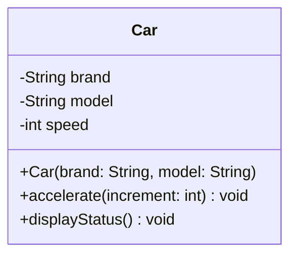
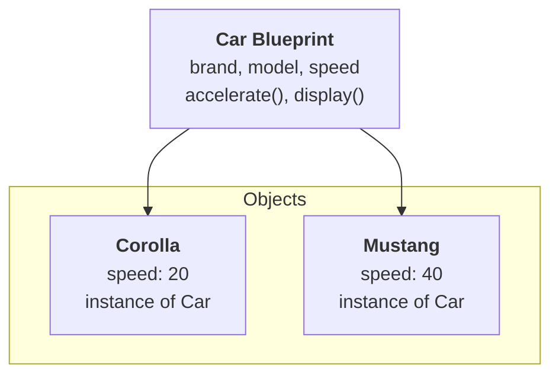

# Classes and Objects in Object-Oriented Programming

Java, Python, C++, C#, Go, and TypeScript all use this concept to organize and structure code around real-world entities.

## 1. What is a Class?

A **class** is a blueprint, template, or recipe for creating objects. It defines what an object will contain (its **data**) and what it will be able to do (its **behavior**).

> [!NOTE]
> A class is not an object itself; it’s a template used to create many objects with similar structure but independent state.

### Real-World Analogy: The Cake Recipe

Think of a class like a recipe for a cake:
- **Ingredients** represent fields or attributes (flour, sugar, eggs $\rightarrow$ variables).
- **Instructions** represent methods or functions (mix, bake, decorate $\rightarrow$ operations).
- The **recipe itself** doesn’t produce a cake; it just defines how to make one. 

When you follow the recipe and bake a cake, you’ve just created an **object**. In code terms: the recipe is your class definition, and each cake you bake is an object with its own flavor, frosting, and size.

### Key Characteristics of a Class:
*   **Encapsulation**: It groups related data (attributes) and actions (methods) together.
*   **State**: Defines attributes to represent the data of an object.
*   **Behavior**: Defines methods (functions inside a class) to represent the actions the object can perform.

---

### Blueprint for a Car

Let’s define a simple `Car` class with essential attributes and methods that any Car object will have.



```typescript
class Car {
    // Attributes (private by default in TypeScript with private keyword)
    private brand: string;
    private model: string;
    private speed: number;

    // Constructor
    constructor(brand: string, model: string) {
        this.brand = brand;
        this.model = model;
        this.speed = 0;
    }

    // Method to accelerate
    accelerate(increment: number): void {
        this.speed += increment;
    }

    // Method to display info
    displayStatus(): void {
        console.log(`${this.brand} is running at ${this.speed} km/h.`);
    }
}
```

This `Car` class defines what every car object should look like (brand, model, speed) and what it can do (accelerate, display status). But a class on its own is just a definition. To actually do anything useful, you need to create **objects** from it.

---

## 2. What is an Object?

An **object** is an instance of a class. It's the actual thing you can interact with, store data in, and invoke methods on.

When you create an object, you’re essentially saying:
> “Take this blueprint (class) and build one actual thing (object) out of it.”

Each object gets its own copy of the data defined in the class, shares the same structure and behavior, and operates independently of every other object created from that same class.

### Creating Objects

Let’s now create a few car objects using our `Car` class.



```typescript
// Creating and using objects
function main(): void {
    // Creating objects of the Car class
    const corolla = new Car("Toyota", "Corolla");
    const mustang = new Car("Ford", "Mustang");

    corolla.accelerate(20);
    mustang.accelerate(40);

    // Displaying status of each car
    corolla.displayStatus();
    console.log("-----------------");
    mustang.displayStatus();
}

// Execute the main function
main();
```

> [!TIP]
> Notice how `corolla` and `mustang` are both `Car` objects, but they maintain completely independent state. When we called `corolla.accelerate(20)`, only the Corolla's speed changed. The Mustang stayed at 0 until we explicitly accelerated it to 40.

---

## 3. Practical Example: Online Food Order

Let's apply classes and objects to a real-world problem: building an order management system for a food delivery platform.

### The Scenario
A food delivery app needs to manage orders. Each order belongs to a customer, contains a list of food items with prices, and tracks whether it has been placed. 

*   **Without classes**: You'd have separate arrays for order IDs, customer names, item lists, and totals with no clean way to enforce rules like "don't add items after placing."
*   **With classes**: The `Order` owns its data and enforces invariants: `addItem()` works only before `placeOrder()`, so invalid states are prevented by design.

```typescript
class FoodOrder {
    private orderId: string;
    private customerName: string;
    private items: string[];
    private totalAmount: number;
    private isPlaced: boolean;

    constructor(orderId: string, customerName: string) {
        this.orderId = orderId;
        this.customerName = customerName;
        this.items = [];
        this.totalAmount = 0;
        this.isPlaced = false;
    }

    // Only allows adding items before the order is placed
    addItem(name: string, price: number): void {
        if (this.isPlaced) {
            console.log("Cannot modify a placed order.");
            return;
        }
        this.items.push(name);
        this.totalAmount += price;
    }

    // Places the order if it has at least one item and hasn't been placed yet
    placeOrder(): boolean {
        if (this.isPlaced || this.items.length === 0) {
            return false;
        }
        this.isPlaced = true;
        return true;
    }

    getItemCount(): number {
        return this.items.length;
    }

    displayOrder(): void {
        const status = this.isPlaced ? "PLACED" : "PENDING";
        console.log(`Order ${this.orderId} (${this.customerName}) - ${status}`);
        for (const item of this.items) {
            console.log(`  - ${item}`);
        }
        console.log(`  Total: $${this.totalAmount.toFixed(2)}`);
    }
}

// Usage
const order1 = new FoodOrder("ORD-101", "Alice");
order1.addItem("Pizza", 12.99);
order1.addItem("Garlic Bread", 4.99);
order1.addItem("Coke", 2.49);
order1.placeOrder();

const order2 = new FoodOrder("ORD-102", "Bob");
order2.addItem("Burger", 9.99);
order2.addItem("Fries", 3.99);

order1.displayOrder();
console.log();
order2.displayOrder();
```

### Why This Design Works
1.  **Encapsulates Order State**: Items, total, and placement status live together. No need to track these in separate data structures.
2.  **Enforces Business Rules**: The `addItem()` method prevents modifications after placement. The object protects its own invariants.
3.  **Reusable**: One class handles every customer order allowing you to create thousands of order objects from the same blueprint.
4.  **Extensible**: Need to add delivery addresses, payment methods, or order tracking later? Add new fields and methods without restructuring your entire codebase.


