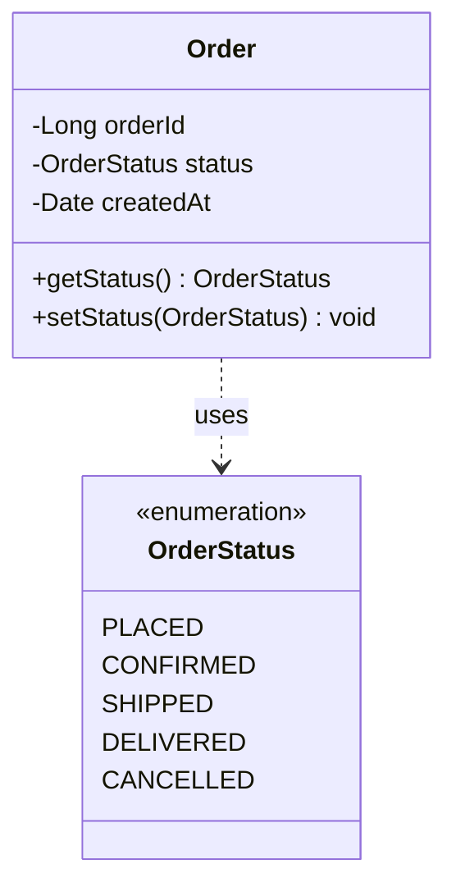

# Enums

An **Enum** (short for enumeration) is a special data type that defines a fixed set of named constants. Enums are **type-safe**, meaning the compiler ensures you can only use values that actually exist in your defined set.

> [!TIP]
> Use an enum whenever a variable can only take one out of a predefined set of valid options.

---

## 1. Why Use Enums?

To appreciate what enums provide, consider the alternative. Without enums, you'd represent order statuses as strings scattered throughout your codebase:

```typescript
String status = "PENDING";

// Somewhere else in the codebase...
if (status.equals("PNDING")) {  // Typo! This condition is never true
    processOrder();
}
```

This code compiles without any warnings. The typo `"PNDING"` is a perfectly valid string as far as the compiler is concerned. The bug only surfaces when a customer complains that their order never gets processed.

Enums eliminate this entire category of bugs. Here are the key advantages:

| Advantage | Description |
| :--- | :--- |
| **Avoid "Magic Values"** | No more scattered strings or integers like `"PENDING"` or `3`. |
| **Improve Readability** | `OrderStatus.SHIPPED` is far more descriptive than the number `3`. |
| **Enable Compiler Checks** | The compiler validates enum usage, catching typos and invalid assignments early. |
| **Support IDE Features** | IDEs provide auto-completion and refactoring tools for enum values. |
| **Reduce Bugs** | You can’t accidentally assign a random string or number that doesn’t belong to the enum. |

### Common Use Cases
Enums are perfect for categories or states that rarely change:
- **Order States**: `PENDING`, `IN_PROGRESS`, `COMPLETED`
- **User Roles**: `ADMIN`, `CUSTOMER`, `DRIVER`
- **Vehicle Types**: `CAR`, `BIKE`, `TRUCK`
- **Directions**: `NORTH`, `SOUTH`, `EAST`, `WEST`

---

## 2. Enum Examples

### Simple Enum
The most basic form of an enum defines a list of named constants. Let's model the status of an order.



```typescript
enum OrderStatus {
    PLACED = "PLACED",
    CONFIRMED = "CONFIRMED",
    SHIPPED = "SHIPPED",
    DELIVERED = "DELIVERED",
    CANCELLED = "CANCELLED"
}
```

**Using it in code:**
```typescript
const status: OrderStatus = OrderStatus.SHIPPED;

if (status === OrderStatus.SHIPPED) {
    console.log("Your package is on the way!");
}
```

### Enums with Properties and Methods
In many languages, each enum value can hold additional data and even define behavior. This makes them powerful for modeling domain concepts.

Consider a `Coin` enum representing U.S. coins and their denominations.

```typescript
class Coin {
    static readonly PENNY = new Coin("PENNY", 1);
    static readonly NICKEL = new Coin("NICKEL", 5);
    static readonly DIME = new Coin("DIME", 10);
    static readonly QUARTER = new Coin("QUARTER", 25);

    private constructor(
        public readonly name: string,
        private readonly value: number
    ) {}

    getValue(): number {
        return this.value;
    }
}

// Usage
const total: number = Coin.DIME.getValue() + Coin.QUARTER.getValue(); // 35
```

> [!NOTE]
> This is more elegant and safe than maintaining separate arrays or lookup maps. The data lives right next to the constant it belongs to.

---

## 3. Practical Example: Order Processing System

This system uses two enums: `OrderStatus` and `PaymentMethod`. They demonstrate how enums bring structure and safety to a real domain model.

### Implementation

```typescript
enum OrderStatus {
    PLACED = "PLACED",
    CONFIRMED = "CONFIRMED",
    SHIPPED = "SHIPPED",
    DELIVERED = "DELIVERED",
    CANCELLED = "CANCELLED"
}

class PaymentMethod {
    static readonly CREDIT_CARD = new PaymentMethod("Credit Card", 2.5);
    static readonly DEBIT_CARD = new PaymentMethod("Debit Card", 1.0);
    static readonly UPI = new PaymentMethod("UPI", 0.0);
    static readonly NET_BANKING = new PaymentMethod("Net Banking", 1.5);

    private constructor(
        public readonly displayName: string,
        public readonly feePercent: number
    ) {}
}

class Order {
    private status: OrderStatus;

    constructor(
        private readonly orderId: string,
        private readonly paymentMethod: PaymentMethod,
        private readonly amount: number
    ) {
        this.status = OrderStatus.PLACED;
    }

    advanceStatus(): boolean {
        const transitions: Partial<Record<OrderStatus, OrderStatus>> = {
            [OrderStatus.PLACED]: OrderStatus.CONFIRMED,
            [OrderStatus.CONFIRMED]: OrderStatus.SHIPPED,
            [OrderStatus.SHIPPED]: OrderStatus.DELIVERED,
        };
        const next = transitions[this.status];
        if (next) {
            this.status = next;
            return true;
        }
        return false;
    }

    cancel(): boolean {
        if (this.status === OrderStatus.PLACED || this.status === OrderStatus.CONFIRMED) {
            this.status = OrderStatus.CANCELLED;
            return true;
        }
        return false;
    }

    getTotalWithFees(): number {
        return this.amount + (this.amount * this.paymentMethod.feePercent / 100);
    }

    displayInfo(): void {
        console.log(
            `Order ${this.orderId} | Status: ${this.status} | ` +
            `Payment: ${this.paymentMethod.displayName} | ` +
            `Amount: $${this.amount.toFixed(2)} (with fees: $${this.getTotalWithFees().toFixed(2)})`
        );
    }
}

// Usage
const order = new Order("ORD-001", PaymentMethod.CREDIT_CARD, 99.99);
order.displayInfo();

order.advanceStatus(); // PLACED -> CONFIRMED
order.advanceStatus(); // CONFIRMED -> SHIPPED
order.displayInfo();

console.log(`Cancel after shipping: ${order.cancel()}`); // false
```

### Why This Design Works

*   **Status transitions are controlled**: The `advanceStatus()` method enforces a valid sequence. You can't jump from `PLACED` to `DELIVERED` or go backwards.
*   **Payment fees are self-contained**: Each `PaymentMethod` carries its own fee percentage. There's no separate lookup table to keep in sync.
*   **Cancellation rules are clear**: The `cancel()` method uses enum comparison to enforce business rules (only allowed before shipping).
*   **Easy to extend**: Need a `RETURNED` status? Add it to the enum and update the transition logic. The compiler will catch missing cases.

---
