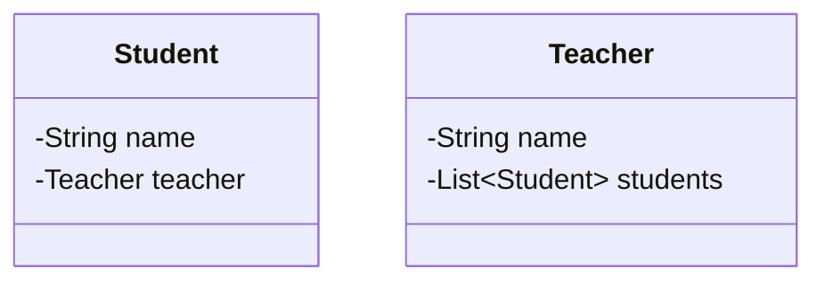
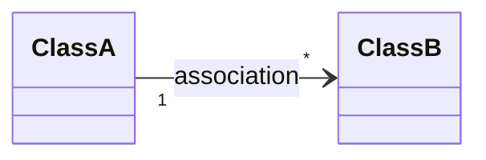
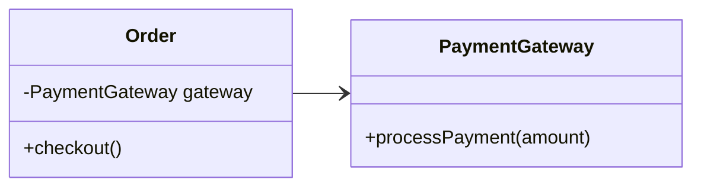
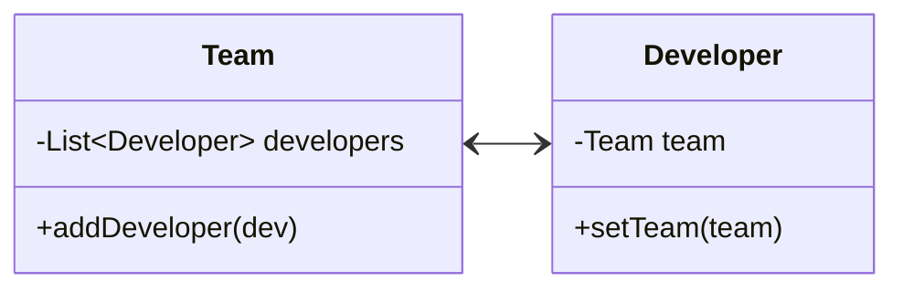
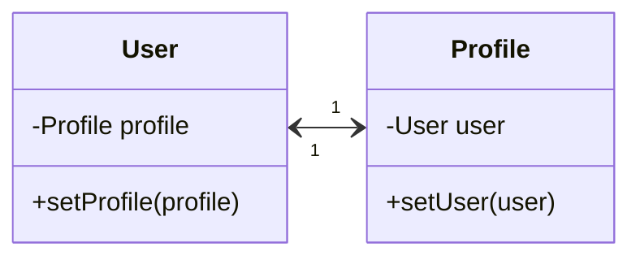
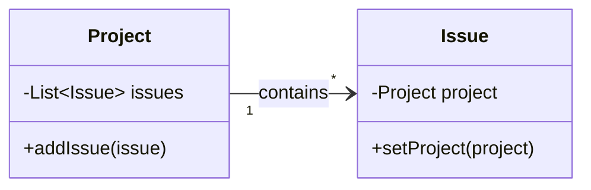
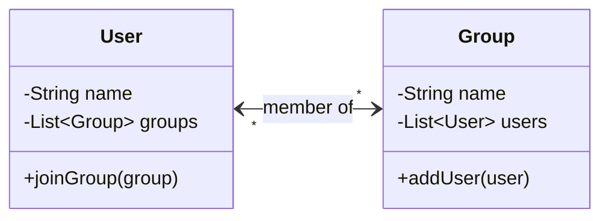
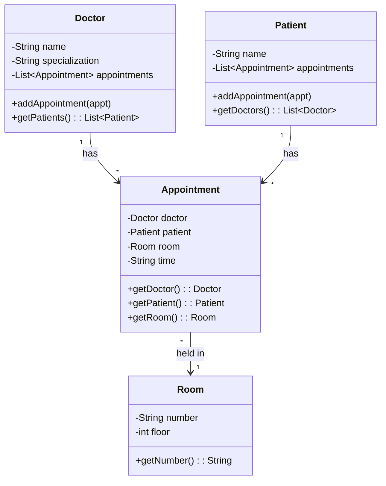

# Association

In the real world, nothing exists in isolation.

* A doctor has patients.
* A driver has a car.
* A student enrolls in courses.

These connections define how different entities interact and collaborate.

When we design software using Object-Oriented Programming (OOP), our goal is to model this real world where objects communicate and work together to achieve meaningful outcomes.

So, how do we represent these connections between our objects?

In this chapter, we will explore the most fundamental and common of these relationships: **Association**.

---

## 1. What is Association?

**Association** represents a relationship between two classes where one object uses, communicates with, or references another.

This relationship models the idea:
> "One object needs to know about the existence of another object to perform its responsibilities"

If Class A must interact with Class B to fulfill its purpose, then Class A is associated with Class B.



However:
* A student can still exist without a teacher.
* A teacher can still exist without any specific student.

This is a real-world association:
* The relationship exists.
* But neither party owns the other.
* Their lifecycles are independent.

### Key Characteristics of Association:
* Association reflects a **"has-a"** or **"uses-a"** relationship.
* Associated objects are **loosely coupled** and can exist independently of one another.
* The association can be unidirectional or bidirectional, and can follow different multiplicity patterns (1-to-1, 1-to-many, etc.).

---

## 2. UML Representation

In UML class diagrams, association is represented by a solid line between two classes.

| Symbol | Meaning | Example Scenario |
| :--- | :--- | :--- |
| Solid line (`---`) | An association between classes | `Student --- Teacher` |
| Arrowhead (`-->`) | Directionality (who knows whom) | `Order --> PaymentGateway` |
| No arrowhead | Bidirectional association | `Team --- Developer` |
| `1` | Exactly one | Each User has one Profile |
| `0..1` | Zero or one (optional) | An Employee may have a Manager |
| `*` | Many (zero or more) | A Project can have many Tasks |
| `1..*` | At least one | Each Course has one or more Students |

Multiplicity defines how many instances of one class can be associated with another. It is written near the class ends in UML diagrams.



The solid line is the key. Inheritance uses a solid line with a hollow triangle. Aggregation adds a hollow diamond. Composition adds a filled diamond. Plain association is just the line, optionally with an arrowhead for direction and multiplicity labels at each end.

---

## 3. Types of Association

Associations between classes can vary depending on how objects are connected and in which direction information flows.

In Object-Oriented Design, associations are primarily defined by two key properties:
1. **Directionality** — Who knows about whom?
2. **Multiplicity** — How many objects are connected?

### 3.1 Based on Direction (Directionality)

Directionality determines which class holds a reference to the other and whether communication is one-way or two-way.

#### a. Unidirectional Association
In a unidirectional association, only one class is aware of or holds a reference to the other class. The referenced class has no knowledge of who is referencing it.



**Example:** An `Order` object uses a `PaymentGateway` to process transactions, but the `PaymentGateway` doesn't keep track of any orders. The order knows about the gateway. The gateway doesn't know about the order.

```typescript
class PaymentGateway {
    processPayment(amount: number): void {
        console.log(`Processing payment of $${amount}`);
    }
}

class Order {
    private gateway: PaymentGateway;

    constructor(gateway: PaymentGateway) {
        this.gateway = gateway;
    }

    checkout(): void {
        this.gateway.processPayment(100.0);
    }
}
```

`Order` holds a reference to `PaymentGateway` and calls its method. But `PaymentGateway` has no field or reference pointing back to `Order`. This is the simplest and most common form of association. When in doubt, start with unidirectional. You can always add the reverse direction later if needed.

#### b. Bidirectional Association
In a bidirectional association, both classes are aware of each other. Each class holds a reference to the other, enabling two-way communication.



**Example:** A `Team` has a list of `Developer`s, and each `Developer` knows which `Team` they belong to. Either side can navigate to the other.

```typescript
class Developer {
    private team?: Team;

    setTeam(team: Team): void {
        this.team = team;
    }
}

class Team {
    private developers: Developer[] = [];

    addDeveloper(dev: Developer): void {
        this.developers.push(dev);
        dev.setTeam(this);
    }
}
```

Notice how `addDeveloper()` updates both sides of the relationship: it adds the developer to the team's list and sets the team reference on the developer. This is important. In a bidirectional association, both references must stay in sync. If you add a developer to the team but forget to set the developer's team reference, you'll get inconsistent state where the team thinks it has the developer, but the developer doesn't know which team it belongs to.

Bidirectional associations are more complex to maintain than unidirectional ones. You need to keep both sides synchronized, which means more code and more opportunities for bugs. Use them only when both sides genuinely need to navigate to the other.

---

### 3.2 Based on Multiplicity

Multiplicity defines how many instances of one class can be associated with instances of another class. It describes the quantity and nature of the connections.

#### a. One-to-One Association
Each object of one class is linked to exactly one object of the other class.



**Example:** Each `User` has exactly one `Profile`, and each `Profile` belongs to one `User`. This is a bidirectional one-to-one relationship.

```typescript
class Profile {
    private user?: User;

    setUser(user: User): void {
        this.user = user;
    }
}

class User {
    private profile?: Profile;

    setProfile(profile: Profile): void {
        this.profile = profile;
        profile.setUser(this);
    }
}
```

One-to-one associations make sense when you want to separate concerns even though the objects are tightly paired. A `User` handles authentication (login, password, roles), while a `Profile` handles display information (avatar, bio, preferences). Merging them into one class would work, but separating them keeps each class focused on a single responsibility.

If you find that two one-to-one associated classes are always created, modified, and deleted together with no independent use case, that's a signal they might belong as a single class instead.

#### b. One-to-Many Association
One object of a class is linked to multiple objects of another class. This is one of the most common patterns in software design.



**Example:** Each `Project` can have many `Issue`s (bug reports, feature requests), but each `Issue` belongs to one `Project`. The project holds a list of issues, and each issue holds a back-reference to its project.

```typescript
class Issue {
    private project?: Project;

    setProject(project: Project): void {
        this.project = project;
    }
}

class Project {
    private issues: Issue[] = [];

    addIssue(issue: Issue): void {
        this.issues.push(issue);
        issue.setProject(this);
    }
}
```

#### c. Many-to-Many Association
Multiple objects from one class are associated with multiple objects from another class. This is common in scenarios involving memberships, enrollments, or tagging systems.



**Example:** A `User` can be a member of multiple `Group`s (WhatsApp groups, Slack channels), and a `Group` can have multiple `User`s. Both sides hold a list of the other. The `joinGroup()` and `addUser()` methods keep both sides in sync.

```typescript
class User {
    private name: string;
    private groups: Group[] = [];

    constructor(name: string) {
        this.name = name;
    }

    joinGroup(group: Group): void {
        if (!this.groups.includes(group)) {
            this.groups.push(group);
            group.addUser(this);
        }
    }

    getName(): string { return this.name; }
    getGroups(): Group[] { return this.groups; }
}

class Group {
    private name: string;
    private users: User[] = [];

    constructor(name: string) {
        this.name = name;
    }

    addUser(user: User): void {
        if (!this.users.includes(user)) {
            this.users.push(user);
            user.joinGroup(this);
        }
    }

    getName(): string { return this.name; }
    getUsers(): User[] { return this.users; }
}

// Usage
const alice = new User("Alice");
const bob = new User("Bob");

const backend = new Group("Backend");
const devOps = new Group("DevOps");

alice.joinGroup(backend);
alice.joinGroup(devOps);
bob.joinGroup(backend);
```

Notice the guard clause in both `joinGroup()` and `addUser()`. Without it, calling `alice.joinGroup(backend)` would add `backend` to Alice's groups, then `backend.addUser(alice)` would add Alice to backend's users, then it would call `alice.joinGroup(backend)` again, and you'd be stuck in an infinite loop. The contains check breaks the recursion.

Many-to-many associations are inherently bidirectional and require careful synchronization. In database design, you'd model this with a join table. In code, both sides hold a list of the other, and you need helper methods that update both sides atomically.

---

## 4. Practical Example: Hospital Appointment System

Let's build a system that combines multiple association types in a realistic domain. A hospital manages doctors, patients, rooms, and appointments. The relationships between these entities demonstrate unidirectional, bidirectional, one-to-many, and many-to-many associations working together.

Here's how the classes connect:
* `Appointment` holds a reference to a `Room` (unidirectional, the room doesn't know about its appointments).
* `Doctor` has a list of `Appointment` objects, and each `Appointment` points back to its `Doctor` (bidirectional one-to-many).
* `Patient` has a list of `Appointment` objects, and each `Appointment` points back to its `Patient` (bidirectional one-to-many).
* `Doctor` and `Patient` are connected many-to-many through `Appointment` as an intermediary. A doctor sees many patients, and a patient can visit many doctors, but they don't reference each other directly.



```typescript
class Room {
    constructor(
        private number: string,
        private floor: number
    ) {}

    getNumber(): string { return this.number; }
    getFloor(): number { return this.floor; }
}

class Appointment {
    constructor(
        private doctor: Doctor,
        private patient: Patient,
        private room: Room,
        private time: string
    ) {
        doctor.addAppointment(this);
        patient.addAppointment(this);
    }

    getDoctor(): Doctor { return this.doctor; }
    getPatient(): Patient { return this.patient; }
    getRoom(): Room { return this.room; }
    getTime(): string { return this.time; }
}

class Doctor {
    private appointments: Appointment[] = [];

    constructor(
        private name: string,
        private specialization: string
    ) {}

    addAppointment(appt: Appointment): void {
        this.appointments.push(appt);
    }

    getPatients(): Patient[] {
        const seen = new Set<Patient>();
        return this.appointments
            .map(a => a.getPatient())
            .filter(p => { if (seen.has(p)) return false; seen.add(p); return true; });
    }

    getName(): string { return this.name; }
    getSpecialization(): string { return this.specialization; }
    getAppointments(): Appointment[] { return this.appointments; }
}

class Patient {
    private appointments: Appointment[] = [];

    constructor(private name: string) {}

    addAppointment(appt: Appointment): void {
        this.appointments.push(appt);
    }

    getDoctors(): Doctor[] {
        const seen = new Set<Doctor>();
        return this.appointments
            .map(a => a.getDoctor())
            .filter(d => { if (seen.has(d)) return false; seen.add(d); return true; });
    }

    getName(): string { return this.name; }
    getAppointments(): Appointment[] { return this.appointments; }
}

// Usage
const drSmith = new Doctor("Dr. Smith", "Cardiology");
const drPatel = new Doctor("Dr. Patel", "Neurology");

const alice = new Patient("Alice");
const bob = new Patient("Bob");

const room101 = new Room("101", 1);
const room205 = new Room("205", 2);

new Appointment(drSmith, alice, room101, "9:00 AM");
new Appointment(drSmith, bob, room101, "10:00 AM");
new Appointment(drPatel, alice, room205, "2:00 PM");

console.log(`${drSmith.getName()}'s patients:`);
for (const p of drSmith.getPatients()) {
    console.log(`  - ${p.getName()}`);
}

console.log(`${alice.getName()}'s doctors:`);
for (const d of alice.getDoctors()) {
    console.log(`  - ${d.getName()} (${d.getSpecialization()})`);
}

console.log(`${drSmith.getName()}'s schedule:`);
for (const a of drSmith.getAppointments()) {
    console.log(`  - ${a.getTime()} with ${a.getPatient().getName()} in Room ${a.getRoom().getNumber()}`);
}
```

### Why This Design Works
* **The `Appointment` class is the intermediary.** Instead of `Doctor` and `Patient` holding direct references to each other (which would create a tangled many-to-many), they connect through `Appointment`. This is a common pattern for modeling many-to-many relationships in code, analogous to a join table in a relational database.
* **Navigation works both ways.** A doctor can find all their patients by walking their appointments. A patient can find all their doctors the same way. Neither class needs to maintain a separate list of the other.
* **Room stays simple.** The room doesn't need to know about appointments. It's just a location. This keeps the relationship unidirectional and avoids unnecessary coupling.
* **Adding data to the relationship is natural.** Because `Appointment` is a full object, you can add fields like time, status, notes, or diagnosis without modifying `Doctor` or `Patient`. Try doing that with a direct many-to-many reference.
