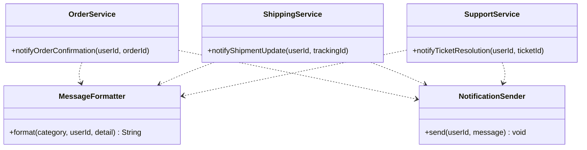

# DRY Principle (Don't Repeat Yourself)

Have you ever copied the same validation logic into multiple classes? Or written the same loop, query, or helper method across several files? Or worse, updated a piece of business logic in one place but forgot it existed in two others?

If so, you have likely violated one of the most fundamental principles in software engineering: the **DRY Principle**, which stands for **"Don’t Repeat Yourself."**

This chapter explains the DRY principle through real-world examples, explores the problems caused by repetition, and offers practical advice to help you write cleaner and more maintainable code.

---

## Table of Contents
1. [What Is the DRY Principle?](#1-what-is-the-dry-principle)
2. [A Real-World Example](#2-a-real-world-example)
3. [Why Repetition Is a Problem](#3-why-repetition-is-a-problem)
4. [Applying DRY](#4-applying-dry)
5. [When It Is Okay to Repeat](#5-when-it-is-okay-to-repeat)
6. [Practical Example: Notification System](#6-practical-example-notification-system)

---

## 1. What Is the DRY Principle?

> “Every piece of knowledge must have a single, unambiguous, authoritative representation within a system.” — *The Pragmatic Programmer*

The DRY principle says that each piece of knowledge in your system should live in exactly one place. When you need that knowledge somewhere else, you reference the single source rather than creating a second copy.

Notice the quote says **"knowledge,"** not "code." This is an important distinction. DRY is not just about avoiding duplicate lines of code. It applies to:

*   **Business rules:** If "users must be 18 or older" is a rule, it should be defined once, not checked in five different places with slightly different age thresholds.
*   **Configuration:** Database connection strings, API keys, and timeout values should live in one config file, not scattered across multiple classes.
*   **Data models:** If a `User` has a name and email, that structure should be defined once, not redefined in every module that touches user data.
*   **Documentation:** If your API docs describe a field as "ISO 8601 date format," that definition should come from one source, not be manually written in three different doc pages.
*   **Tests:** Shared setup logic (like creating test users or populating a database) should be extracted into helpers rather than copy-pasted across test files.

Whenever the same concept appears in more than one place, you introduce redundancy. Redundancy makes your system harder to maintain and more prone to bugs.

> [!TIP]
> ### The Rule of Three
> Before you rush off to extract every bit of repeated code into a shared utility, there is an important guideline to keep in mind: **the Rule of Three**.
> 
> The idea is simple: Before extracting shared logic, **wait until you see the same pattern three times**. Two occurrences might be coincidental. Maybe those two pieces of code look similar today but will diverge tomorrow as their respective features evolve. Three occurrences, though, indicate a genuine pattern.
> 
> At that point, you have strong evidence that the duplication represents shared knowledge, and extracting it into a single location is the right call.

---

## 2. A Real-World Example

Imagine you are building a system to manage users across three modules: authentication, payments, and messaging. Each module contains its own copy of the email validation logic.

```typescript
// In authService.ts
function isValidEmail(email: string): boolean {
    return email != null && email.includes("@") && email.includes(".");
}

// In paymentService.ts
function isValidEmail(email: string): boolean {
    return email != null && email.includes("@") && email.includes(".");
}

// In messagingService.ts
function isValidEmail(email: string): boolean {
    return email != null && email.includes("@") && email.includes(".");
}
```

Now suppose the business changes the rule: **email addresses must now end with .com or .org**

If this logic is duplicated across three modules, you need to update every single location. Miss even one, and the system becomes inconsistent. Users might pass validation in the auth module but fail in the payments module, or vice versa. You have created technical debt that will only grow worse over time.

---

## 3. Why Repetition Is a Problem

Duplication might seem harmless for small projects, but the problems compound as the codebase grows. Here are the four main reasons repeated knowledge is dangerous:

### 1. Harder to Maintain
When a rule or piece of logic changes, you must find and update every occurrence. In a small project, you might remember all three locations. In a codebase with 500 files and multiple contributors, you will not. Missing even one copy leads to inconsistent behavior that is difficult to trace.

### 2. Higher Risk of Bugs
More copies mean more chances for errors. Suppose the original validation checks `email.contains("@")`, but when someone copies it to a new module, they accidentally write `email.contains("@")` but forget the null check. Now one module crashes on null input while the others handle it gracefully. The bug is invisible until a null email reaches that specific module in production.

### 3. Bloated Codebase
Redundant logic adds noise. When reading through a codebase, you want to quickly identify what is unique versus what is shared. If the same 10-line validation block appears in 15 files, those 150 lines contribute nothing new. They just make the codebase harder to navigate and understand.

### 4. Poor Test Coverage
When logic is repeated, each copy needs its own tests. If you have email validation in three modules, you need three sets of tests to cover the same behavior. When someone adds a new validation rule, they need to remember to update all three test files as well. In practice, they usually update one, maybe two, and leave the third untested.

> [!WARNING]
> ### Copy-Paste Is a Red Flag
> Copying and pasting code might seem convenient, but it often leads to long-term problems.
> 
> **Ask yourself:** If I need to change this logic in the future, will I remember all the places where it exists?
> 
> If the answer is "no" or even "uncertain," you are creating risk. Following the DRY principle reduces that risk.

---

## 4. Applying DRY

Let's refactor the email validation example by extracting the common logic into a single, shared location.

### Step 1: Create a Utility Class
Extract the validation logic into a dedicated class that becomes the single source of truth.

```typescript
export class EmailValidator {
    static isValid(email: string): boolean {
        return email != null
            && email.includes("@")
            && email.includes(".")
            && (email.endsWith(".com") || email.endsWith(".org"));
    }
}
```

### Step 2: Use It Across Modules
Now every module delegates to the shared validator instead of implementing its own.

```typescript
// In authService.ts
if (EmailValidator.isValid(user.email)) {
    // Proceed with authentication
}

// In paymentService.ts
if (EmailValidator.isValid(customer.email)) {
    // Proceed with payment processing
}

// In messagingService.ts
if (EmailValidator.isValid(recipient.email)) {
    // Proceed with sending message
}
```

Now the email validation logic lives in one place. Any future updates, like adding regex-based validation or supporting new top-level domains, only need to be made once. All three modules stay consistent automatically.

---

## 5. When It Is Okay to Repeat

The DRY principle is a guideline, not a strict rule. There are situations where a bit of repetition produces better code than a forced abstraction.

### 1. Avoid Premature Abstractions
Do not extract shared code too early. Let duplication reveal itself first. Abstractions created too soon can be misleading or hard to maintain.

> “Duplication is far cheaper than the wrong abstraction.” — *Sandi Metz*

### 2. Keep Tests Readable
Tests need to be easy to read in isolation. If a test fails, the developer reading it should be able to understand the setup, the action, and the expected result without jumping to five different helper methods.

Consider this test:

```typescript
test("should reject invalid email", () => {
    const user = new User("Alice", "invalid-email");

    const result = EmailValidator.isValid(user.email);

    expect(result).toBe(false);
});

test("should accept valid email", () => {
    const user = new User("Bob", "bob@example.com");

    const result = EmailValidator.isValid(user.email);

    expect(result).toBe(true);
});
```

Yes, `new User(...)` appears in both tests. You could extract it into a factory method. But doing so would force the reader to look elsewhere to understand what kind of user is being created. In tests, **clarity beats brevity**. A small amount of repetition is a reasonable trade-off for tests that tell their story from top to bottom.

### 3. Keep It Simple
If a line of code is extremely simple and unlikely to change, extracting it into a shared utility can actually make things worse. Creating a `MathUtils.addOne(x)` method to avoid writing `x + 1` in two places is not DRY—it is **overengineering**. The overhead of finding, understanding, and navigating to the shared method outweighs the benefit of eliminating the trivial duplication.

---

## 6. Practical Example: Notification System

Let's look at a more realistic scenario that goes beyond simple validation. This example shows how DRY applies to larger pieces of duplicated behavior.

### The Problem
You have three services—`OrderService`, `ShippingService`, and `SupportService`—that all need to send notifications to users. Each service currently duplicates two pieces of logic: formatting a message and sending it via an external notification API.

#### Before: Violating DRY
Each service contains its own copy of the message formatting and sending logic.

```typescript
class OrderService {
    notifyOrderConfirmation(userId: string, orderId: string): void {
        // Duplicated: message formatting
        const message = `[Order] Hi ${userId}, your order ${orderId} has been confirmed.`;
        const formatted = message.charAt(0).toUpperCase() + message.slice(1);

        // Duplicated: sending logic
        console.log("Connecting to notification API...");
        console.log(`Sending to ${userId}: ${formatted}`);
        console.log("Notification sent successfully.");
    }
}

class ShippingService {
    notifyShipmentUpdate(userId: string, trackingId: string): void {
        // Duplicated: message formatting
        const message = `[Shipping] Hi ${userId}, your shipment ${trackingId} is on its way.`;
        const formatted = message.charAt(0).toUpperCase() + message.slice(1);

        // Duplicated: sending logic
        console.log("Connecting to notification API...");
        console.log(`Sending to ${userId}: ${formatted}`);
        console.log("Notification sent successfully.");
    }
}

class SupportService {
    notifyTicketResolution(userId: string, ticketId: string): void {
        // Duplicated: message formatting
        const message = `[Support] Hi ${userId}, your ticket ${ticketId} has been resolved.`;
        const formatted = message.charAt(0).toUpperCase() + message.slice(1);

        // Duplicated: sending logic
        console.log("Connecting to notification API...");
        console.log(`Sending to ${userId}: ${formatted}`);
        console.log("Notification sent successfully.");
    }
}
```

#### After: DRY Applied
We extract the duplicated behavior into two focused classes: `MessageFormatter` handles message formatting, and `NotificationSender` handles the sending logic.



```typescript
class MessageFormatter {
    static format(category: string, userId: string, detail: string): string {
        const message = `[${category}] Hi ${userId}, ${detail}`;
        return message.charAt(0).toUpperCase() + message.slice(1);
    }
}

class NotificationSender {
    static send(userId: string, message: string): void {
        console.log("Connecting to notification API...");
        console.log(`Sending to ${userId}: ${message}`);
        console.log("Notification sent successfully.");
    }
}

class OrderService {
    notifyOrderConfirmation(userId: string, orderId: string): void {
        const message = MessageFormatter.format(
            "Order", userId, `your order ${orderId} has been confirmed.`);
        NotificationSender.send(userId, message);
    }
}

class ShippingService {
    notifyShipmentUpdate(userId: string, trackingId: string): void {
        const message = MessageFormatter.format(
            "Shipping", userId, `your shipment ${trackingId} is on its way.`);
        NotificationSender.send(userId, message);
    }
}

class SupportService {
    notifyTicketResolution(userId: string, ticketId: string): void {
        const message = MessageFormatter.format(
            "Support", userId, `your ticket ${ticketId} has been resolved.`);
        NotificationSender.send(userId, message);
    }
}
```

### Why This Design Works
*   **Single source of truth for formatting:** If you need to change the message template (for example, adding a timestamp or changing the greeting), you update `MessageFormatter` once.
*   **Single source of truth for sending:** If the notification API changes (new endpoint, new authentication, retry logic), you update `NotificationSender` once.
*   **Separation of Concerns:** Each service focuses on its own responsibility. `OrderService` knows about orders. `ShippingService` knows about shipments. Neither knows the details of formatting or sending.
*   **Easy to test:** You can unit test `MessageFormatter` and `NotificationSender` in isolation. You can mock them when testing the services.
*   **Easy to extend:** Adding a `BillingService` that also sends notifications requires zero changes to the existing code. Just call `MessageFormatter.format()` and `NotificationSender.send()`.
