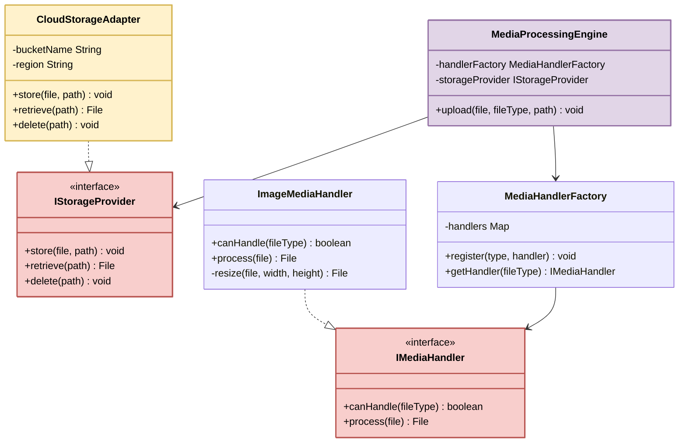
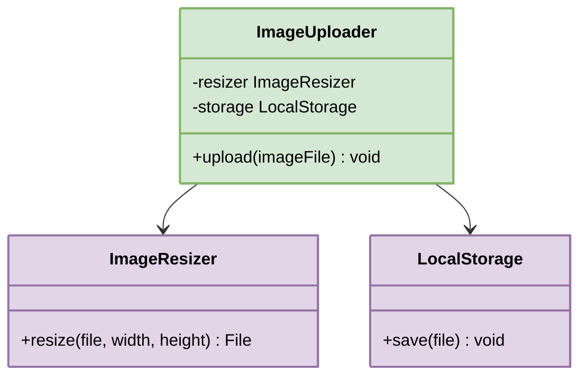

# YAGNI Principle (You Aren't Gonna Need It)

Have you ever added a feature because you might need it someday?

Or built an abstraction for a use case that doesn't exist yet?

Or created extra flexibility that no one has ever used?

If so, you’ve broken one of the most pragmatic principles in software development: **YAGNI**, which stands for **"You Aren’t Gonna Need It."**

It sounds obvious. Of course you shouldn't build things you don't need. But in practice, developers violate this principle all the time. We build plugin systems for a single plugin.

We write factory classes when there's only one implementation. We add configuration options nobody will ever change. All because we convince ourselves that *"we might need it later."*

Let’s unpack what YAGNI really means, why it’s often ignored, and how following it can keep your codebase focused, lean, and easier to maintain.

---

## Table of Contents
1. [What Is the YAGNI Principle?](#1-what-is-the-yagni-principle)
2. [The Real-World Problem](#2-the-real-world-problem)
3. [Why Premature Work Is Harmful](#3-why-premature-work-is-harmful)
4. [When to Bend the Rule](#4-when-to-bend-the-rule)

---

## 1. What Is the YAGNI Principle?

> “Always implement things when you actually need them, never when you just foresee that you need them.” — *Ron Jeffries, co-founder of Extreme Programming*

YAGNI is a principle that encourages you to resist the temptation to build features or add flexibility until you are absolutely sure you need them.

In simple terms: **Don’t build for tomorrow. Build for today.**

The principle comes from Extreme Programming (XP), one of the earliest Agile methodologies. XP was built around the idea that software requirements change constantly, so spending time building for predicted futures is wasteful. Instead, you deliver the simplest thing that works right now, and you iterate from there.

YAGNI fits perfectly into this philosophy: if you don't know for certain that a feature is needed, don't build it. When the need actually arises, you'll have far better information about what to build and how to build it.

This doesn't mean you write sloppy code or ignore good design. It means you don't add layers of abstraction, extra interfaces, or speculative features until a real requirement justifies them. There's a big difference between writing clean, well-structured code for today's needs and over-engineering for tomorrow's imagined ones.

---

## 2. The Real-World Problem

Suppose you are working on a project that involves uploading user profile pictures. Your current requirement is simple:

1.  Accept an image
2.  Resize it to 300x300
3.  Store it on the local filesystem

Three steps. Straightforward. But then you start thinking ahead:

*   *What if we need video uploads later?* Better add a media handler interface.
*   *What if we switch to cloud storage?* Better add a storage provider abstraction.
*   *What if users want 3D avatars?* Better make the system extensible.
*   *What if other teams want to plug in their own handlers?* Better build a plugin system.

So instead of writing a simple image uploader, you build something like this:

### The Overengineered Version (YAGNI Violation)



```typescript
// Interface for handling different media types
interface IMediaHandler {
    canHandle(fileType: string): boolean;
    process(file: File): File;
}

// Interface for storage providers
interface IStorageProvider {
    store(file: File, path: string): void;
    retrieve(path: string): File;
    delete(path: string): void;
}

// Factory for creating media handlers
class MediaHandlerFactory {
    private handlers: Map<string, IMediaHandler> = new Map();

    register(type: string, handler: IMediaHandler): void {
        this.handlers.set(type, handler);
    }

    getHandler(fileType: string): IMediaHandler {
        const handler = this.handlers.get(fileType);
        if (!handler) {
            throw new Error(`No handler for type: ${fileType}`);
        }
        return handler;
    }
}

// Cloud storage adapter (not needed yet)
class CloudStorageAdapter implements IStorageProvider {
    constructor(
        private bucketName: string,
        private region: string
    ) {}

    store(file: File, path: string): void {
        // Cloud upload logic - not implemented, not needed
    }

    retrieve(path: string): File {
        // Cloud download logic - not implemented, not needed
        return null as any;
    }

    delete(path: string): void {
        // Cloud delete logic - not implemented, not needed
    }
}

// Image handler (the only one actually needed)
class ImageMediaHandler implements IMediaHandler {
    canHandle(fileType: string): boolean {
        return fileType === "image";
    }

    process(file: File): File {
        return this.resize(file, 300, 300);
    }

    private resize(file: File, width: number, height: number): File {
        // actual resize implementation
        return file;
    }
}

// The bloated engine that ties it all together
class MediaProcessingEngine {
    constructor(
        private handlerFactory: MediaHandlerFactory,
        private storageProvider: IStorageProvider
    ) {}

    upload(file: File, fileType: string, path: string): void {
        const handler = this.handlerFactory.getHandler(fileType);
        const processed = handler.process(file);
        this.storageProvider.store(processed, path);
    }
}
```

Look at what happened. The requirement was three lines of real work: accept, resize, store. But we created 6 classes and interfaces to do it. The `CloudStorageAdapter` has empty method bodies. The `MediaHandlerFactory` manages exactly one handler. The `IStorageProvider` interface has a `retrieve` and `delete` method that nothing calls.

We've written dozens of lines of infrastructure code that serves no user and solves no problem.

### The Simple Version (YAGNI Applied)

Now here's what the code looks like when you apply YAGNI:



```typescript
class ImageUploader {
    private readonly resizer: ImageResizer;
    private readonly storage: LocalStorage;

    constructor(resizer: ImageResizer, storage: LocalStorage) {
        this.resizer = resizer;
        this.storage = storage;
    }

    upload(imageFile: File): void {
        const resized = this.resizer.resize(imageFile, 300, 300);
        this.storage.save(resized);
    }
}
```

This code:

*   **Meets today's requirements completely**
*   **Is easy to read, test, and debug**
*   **Can be extended later when a real need arises**
*   **Has no dead code, no empty method stubs, no speculative abstractions**

If the requirement to support cloud storage or video formats arises tomorrow, that's the time to refactor and extend. Not before.

---

## 3. Why Premature Work Is Harmful

> [!WARNING]
> ### The Illusion of Being Prepared
> You might think, *"What's the harm in being prepared?"* Quite a lot, actually. Every line of speculative code carries hidden costs that compound over time.

### 1. Wasted Time and Effort
Every hour spent building features that are not needed is time not spent building what actually matters. In the image upload example, the developer spent time writing `CloudStorageAdapter`, `MediaHandlerFactory`, and `IStorageProvider` before even one user uploaded a profile photo. That's development time, code review time, and testing time, all spent on features with zero users.

### 2. Increased Complexity
Extra flexibility adds more moving parts. It becomes harder to understand, test, and modify your code. A new developer joining the team sees the `MediaProcessingEngine` with its factory and provider interfaces and assumes there's a reason for all that complexity. They're afraid to simplify it because they think *"someone must have needed this."* The speculative code becomes permanent by accident.

### 3. Delayed Value
By working on "someday" features, you delay shipping the features users need today. If the simple image uploader could have been done in an afternoon but the overengineered version took a week, you've delayed value delivery by four days, all for features nobody asked for.

### 4. Higher Maintenance Costs
Even unused features have a cost. They can introduce bugs, require updates when dependencies change, and get in the way of refactoring. When you want to upgrade your storage library, you now have to update both `LocalStorage` and `CloudStorageAdapter`, even though nobody uses the cloud adapter. Dead code is not free. It's debt.

---

## 4. When to Bend the Rule

Like all principles, YAGNI has exceptions. Sometimes, planning ahead is justified. The key is distinguishing between speculative features (driven by "what if") and known constraints (driven by real requirements, regulations, or contractual obligations).

### 1. Security and Compliance
If you're building a system that handles financial data, health records, or personal information, you may need audit trails, encryption, and access controls from day one. These aren't speculative features. They're **legal requirements**.

### 2. Architecture with Known Long-Term Constraints
If you're building a system that has contractual SLAs for uptime, or you know from the start that it must handle cross-region replication, some architectural decisions need to be made early. Retrofitting high availability into a system that wasn't designed for it is far more expensive than building it in from the start.

### 3. Reusable Libraries or Frameworks
If you're building a library that other teams will depend on, some flexibility is expected. API design for libraries requires more upfront thought because breaking changes affect many consumers. But even here, start with a minimal API and expand it based on actual usage patterns.

> [!IMPORTANT]
> ### The Concrete Thread
> The common thread in all these exceptions: **the need is known and concrete, not imagined.** You're not guessing that you might need audit logging. You know you need it because the law says so.