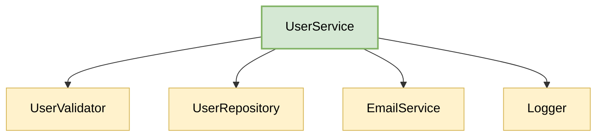

# Separation of Concerns

Have you ever seen a class that fetches data from the database, formats it for the UI, logs the result, and also sends a notification?

Or worked with a function that handles validation, business logic, database access, and exception handling, all in one place?

If so, you’ve witnessed a violation of Separation of Concerns (SoC), one of the most important architectural principles in software engineering.

In this chapter, we’ll explore what SoC really means, why it matters, how to apply it, and how it leads to cleaner, more testable, and maintainable code.

---

## Table of Contents
1. [What is Separation of Concerns?](#1-what-is-separation-of-concerns)
2. [The Problem (The "God Class")](#2-the-problem-the-god-class)
3. [What’s Wrong With This?](#3-whats-wrong-with-this)
4. [Refactoring: Separating the Concerns](#4-refactoring-separating-the-concerns)
5. [Key Dimensions of Separation](#5-key-dimensions-of-separation)
6. [Benefits of Separation of Concerns](#6-benefits-of-separation-of-concerns)
7. [Common Questions and Pitfalls](#7-common-questions-and-pitfalls)

---

## 1. What is Separation of Concerns?

> “We know that a program to be useful must be correct, and we can only establish correctness if we can understand it. But we cannot understand it if we do not separate concerns.” — *Edsger W. Dijkstra, 1974*

**Separation of Concerns (SoC)** is a core software design principle stating that a program should be split into distinct sections, where each section addresses a single "concern." 

A **concern** is a specific responsibility, task, or piece of logic within an application. Examples of concerns include:
*   **Business Logic**: The core rules of your application (e.g., calculating interest rates, validating a transaction).
*   **Data Persistence**: How data is stored and retrieved (e.g., SQL queries, API calls, file access).
*   **User Interface (UI)**: How data is presented to the user and how user input is captured.
*   **Communication**: How the system interacts with external entities (e.g., sending emails, SMS, or push notifications).
*   **Cross-Cutting Concerns**: Core functions needed across the entire application (e.g., logging, security, error handling, caching).

### Real-World Analogy: The Restaurant

Imagine a restaurant where one person handles every single task:
1. Greets you at the door.
2. Takes your order.
3. Runs to the kitchen to cook the steak.
4. Washes the dishes.
5. Runs the cash register.

This restaurant would be a bottleneck. If the chef is washing dishes, customers wait to order. If the chef is taking orders, steaks get burned. 

In a professional restaurant, concerns are separated:
*   The **Host** greets guests.
*   The **Waiter** manages tables and orders.
*   The **Chef** focuses on cooking.
*   The **Dishwasher** keeps plates clean.
*   The **Cashier** handles payments.

By dividing these roles, the restaurant works efficiently. Each person becomes highly skilled in their domain, and changes in one role (e.g., a new cashier terminal) don't disrupt the cooking of the steaks. In software, SoC does the exact same thing for your code.

---

## 2. The Problem (The "God Class")

In software development, violating SoC leads to the creation of **"God Classes"** (or bloated modules) — classes that know too much and do too much.

Let's look at a class designed to handle user registration. It violates SoC by taking on validation, logging, database queries, HTML template formatting, and SMTP email sending.

```mermaid
flowchart TD
    subgraph UserManager [UserManager (God Class)]
        Validation[Validation Logic]
        Database[Database Queries]
        Business[Business Rules]
        Formatting[Email HTML Formatting]
        SMTP[SMTP Email Sending]
        Logging[Logging Details]
    end
    Client[Client Code] --> UserManager
    
    style UserManager fill:#f8cecc,stroke:#b85450,stroke-width:2px,color:#000
    style Client fill:#fff2cc,stroke:#d6b656,stroke-width:1px,color:#000
```

Here is how this God Class looks in TypeScript:

```typescript
class UserManager {
    private dbConnection: any; // Assume initialized database pool

    constructor(dbConnection: any) {
        this.dbConnection = dbConnection;
    }

    async registerUser(userData: any): Promise<void> {
        // Concern 1: Input Validation
        if (!userData.email || !userData.email.includes("@")) {
            throw new Error("Invalid email address.");
        }
        if (!userData.password || userData.password.length < 8) {
            throw new Error("Password must be at least 8 characters.");
        }

        // Concern 2: Logging
        console.log(`[LOG] Registering user with email: ${userData.email}`);

        // Concern 3: Database query (Checking duplicate users)
        const userExists = await this.dbConnection.query(
            `SELECT * FROM users WHERE email = ?`,
            [userData.email]
        );
        if (userExists) {
            throw new Error("User already exists.");
        }

        // Concern 4: Core Business Logic (Creating user object)
        const newUser = {
            id: Math.random().toString(36).substr(2, 9),
            email: userData.email,
            password: userData.password, // Raw password - security concern!
            status: "PENDING",
            createdAt: new Date()
        };

        // Concern 3 (continued): Database execute (Persisting user data)
        await this.dbConnection.execute(
            `INSERT INTO users (id, email, password, status, created_at) VALUES (?, ?, ?, ?, ?)`,
            [newUser.id, newUser.email, newUser.password, newUser.status, newUser.createdAt]
        );

        // Concern 5: Formatting Email Template
        const emailSubject = "Welcome to Our Platform!";
        const emailBody = `
            <html>
                <body>
                    <h1>Welcome, ${newUser.email}!</h1>
                    <p>Your account has been created. Please verify your email.</p>
                </body>
            </html>
        `;

        // Concern 6: External Communication (Sending SMTP email)
        const smtpHost = "smtp.example.com";
        console.log(`[SMTP] Connecting to ${smtpHost}...`);
        console.log(`[SMTP] Sending email to ${newUser.email} with subject: ${emailSubject}`);
        
        // Concern 2 (continued): Logging
        console.log(`[LOG] User registered successfully: ${newUser.id}`);
    }
}
```

---

## 3. What’s Wrong With This?

### 1. High Coupling
The `UserManager` class is tightly coupled to concrete implementations of a SQL database, standard output logging (`console.log`), and SMTP mail protocols. If you change your database from SQLite to MongoDB, or swap SMTP for an API-based service like SendGrid, you are forced to edit the core user registration module.

### 2. High Fragility
Because multiple concerns are mixed together, changing one part of the code can easily break another. For instance, modifying the HTML string in the email template could introduce a syntax error or logic bug that causes the entire registration process to crash, preventing users from signing up.

### 3. Zero Reusability
The email template layout and SMTP sending logic are trapped inside `registerUser`. If you want to build a "Reset Password" function, you cannot reuse the email code. You will be forced to duplicate the SMTP connection and formatting logic elsewhere, violating the **DRY (Don't Repeat Yourself)** principle.

### 4. Poor Testability
Testing this class is incredibly painful. 

> [!WARNING]
> ### The Mocking Nightmare
> To write a simple unit test checking that `registerUser` rejects an invalid email, you must:
> 1. Set up a mock database connection.
> 2. Stub SQL response objects.
> 3. Provide mock configurations for SMTP servers.
> 
> You are forced to mock infrastructure details that have absolutely nothing to do with basic validation logic. This makes tests slow, complex, and fragile.

---

## 4. Refactoring: Separating the Concerns

To fix these violations, we decompose our God Class into modular components, where each component has exactly one concern. 



Let's implement this modular structure:

### Step 1: Extract the Logger Concern
```typescript
class Logger {
    info(message: string): void {
        console.log(`[INFO] ${new Date().toISOString()}: ${message}`);
    }
    
    error(message: string): void {
        console.error(`[ERROR] ${new Date().toISOString()}: ${message}`);
    }
}
```

### Step 2: Extract the Validation Concern
```typescript
class UserValidator {
    validate(userData: any): void {
        if (!userData.email || !userData.email.includes("@")) {
            throw new Error("Invalid email address.");
        }
        if (!userData.password || userData.password.length < 8) {
            throw new Error("Password must be at least 8 characters.");
        }
    }
}
```

### Step 3: Extract the Data Access Concern (Repository Pattern)
```typescript
interface IUserRepository {
    exists(email: string): Promise<boolean>;
    save(user: any): Promise<void>;
}

class SqlUserRepository implements IUserRepository {
    private dbConnection: any;

    constructor(dbConnection: any) {
        this.dbConnection = dbConnection;
    }

    async exists(email: string): Promise<boolean> {
        const result = await this.dbConnection.query(
            `SELECT * FROM users WHERE email = ?`,
            [email]
        );
        return !!result;
    }

    async save(user: any): Promise<void> {
        await this.dbConnection.execute(
            `INSERT INTO users (id, email, password, status, created_at) VALUES (?, ?, ?, ?, ?)`,
            [user.id, user.email, user.password, user.status, user.createdAt]
        );
    }
}
```

### Step 4: Extract the Communication Concern
```typescript
class EmailService {
    private smtpClient: any; // Assume configured client

    constructor() {
        this.smtpClient = {};
    }

    async sendWelcomeEmail(email: string): Promise<void> {
        const subject = "Welcome to Our Platform!";
        const body = this.generateWelcomeTemplate(email);
        
        console.log(`[SMTP] Sending welcome email to ${email}`);
        // Code to transmit email using smtpClient...
    }

    private generateWelcomeTemplate(email: string): string {
        return `
            <html>
                <body>
                    <h1>Welcome, ${email}!</h1>
                    <p>Your account has been created. Please verify your email.</p>
                </body>
            </html>
        `;
    }
}
```

### Step 5: Orchestrate via the `UserService`
The `UserService` only handles the orchestrating business workflow. It coordinates the helpers to register a user.

```typescript
class UserService {
    private validator: UserValidator;
    private repository: IUserRepository;
    private emailService: EmailService;
    private logger: Logger;

    constructor(
        validator: UserValidator,
        repository: IUserRepository,
        emailService: EmailService,
        logger: Logger
    ) {
        this.validator = validator;
        this.repository = repository;
        this.emailService = emailService;
        this.logger = logger;
    }

    async registerUser(userData: any): Promise<void> {
        // 1. Validate inputs
        this.validator.validate(userData);
        this.logger.info(`Valid registration inputs received for: ${userData.email}`);

        // 2. Business check for duplicate user
        const userExists = await this.repository.exists(userData.email);
        if (userExists) {
            throw new Error("User already exists.");
        }

        // 3. Construct entity
        const newUser = {
            id: Math.random().toString(36).substr(2, 9),
            email: userData.email,
            password: userData.password, // Note: Encryption is another concern!
            status: "PENDING",
            createdAt: new Date()
        };

        // 4. Save to Database
        await this.repository.save(newUser);
        this.logger.info(`User record created for: ${newUser.id}`);

        // 5. Send Welcome Email
        await this.emailService.sendWelcomeEmail(newUser.email);
        this.logger.info(`User registration lifecycle completed.`);
    }
}
```

---

## 5. Key Dimensions of Separation

SoC can be applied at multiple scales in software development:

### 1. Horizontal Separation (Layers)
Organizing code based on its role in the data flow of the application. The most common pattern is the **Layered Architecture**:

```
[ Presentation Layer ]  -->  Handles user interaction and UI display (e.g. Controllers, Views)
         |
         v
[ Application Layer ]   -->  Orchestrates application use cases (e.g. Services)
         |
         v
[   Domain Layer    ]   -->  Encapsulates core business rules and invariants (e.g. Entities)
         |
         v
[Infrastructure Layer]  -->  Deals with external systems (e.g. Repositories, DB Clients)
```

### 2. Vertical Separation (Features)
Dividing code by business capabilities or domain features, rather than technical layers. 
Instead of grouping all controllers together and all repositories together, you group code by domain boundaries (e.g., `BillingModule`, `AuthModule`, `SearchModule`). This minimizes the surface area of dependencies across modules.

### 3. Separation of Cross-Cutting Concerns
Some concerns, like logging, authorization, caching, and error handling, apply to every single layer of your application. Instead of duplicating this code across all functions, we separate them using design techniques such as:
*   **Decorator Pattern / Middleware**: Wrapping core functions with loggers or authorization checks.
*   **Aspect-Oriented Programming (AOP)**: Dynamically injecting cross-cutting logic at compile-time or runtime.

---

## 6. Benefits of Separation of Concerns

*   **Ease of Maintenance**: If you need to fix a database issue, you only touch the Repository. If you need to edit an email template, you only touch the Email Service. The risk of side effects is virtually zero.
*   **Superb Testability**: You can write clean unit tests for the `UserValidator` without mock setups. To test the `UserService` workflow, you can pass a simple stubbed `IUserRepository` without opening real database connections.
*   **High Reusability**: The `EmailService` can be reused by a `BillingService` to send receipts, or by an `AuthService` to send password reset links.
*   **Fewer Merge Conflicts**: Team members can divide tasks effectively. One developer can redesign the database schema, while another works on visual frontend templates, without conflicting in the same source file.
*   **Reduced Cognitive Load**: A developer reading `UserService` doesn't need to digest SQL strings or SMTP handshakes. They can focus entirely on the business flow.

---

## 7. Common Questions and Pitfalls

### How do I know if I’ve gone too far? (Over-separation)
It is possible to over-apply SoC. If you create a separate file and class for checking if a string is empty, another for checking if it contains an email, and another for formatting error messages, you've over-engineered. 
This introduces **indirection bloat**, which increases cognitive load and violates the **KISS Principle**. The goal is a balanced separation: code that belongs to the same domain responsibility should remain cohesive.

### Cohesion vs Coupling: Isn't putting HTML, CSS, and JS together in React/Vue components a violation of SoC?
Traditionally, developers were told to separate concerns by technology: HTML for structure, CSS for styling, and JS for behavior. 

Modern frontend frameworks (like React, Vue, and Svelte) challenged this by combining markup, styling, and behavior inside a single component file. Is this a violation of SoC?

> [!TIP]
> ### Component-Based Concern Boundaries
> This is actually a **different concern boundary**, not a violation.
> *   **Old Boundary**: Separating by *Technology* (HTML vs CSS vs JS).
> *   **New Boundary**: Separating by *Component / Feature* (e.g., `Button` vs `Navbar` vs `Sidebar`).
> 
> A visual button component is a single, cohesive concern. Grouping its structure, behavior, and styling makes it far more reusable and maintainable. Separating them across three different directories makes the button hard to change and trace. High cohesion inside a module is a core goal of SoC.

### Is SoC the same as the Single Responsibility Principle (SRP)?
They are close cousins, but they apply at different levels:
*   **Separation of Concerns (SoC)**: A broad, systemic design guideline focusing on separating whole sections of an application (e.g., separating the UI layer from the database layer).
*   **Single Responsibility Principle (SRP)**: A class-level rule (the "S" of SOLID) stating that a class should have one, and only one, reason to change. SRP is a way of achieving SoC inside an object-oriented codebase.
