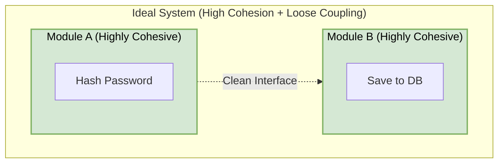
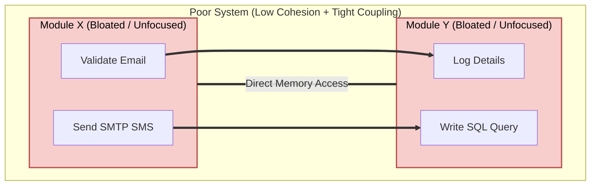

# Coupling and Cohesion

When you design a system at the low-level, you are not just deciding what classes exist. You are deciding how those classes depend on each other and how responsibilities are distributed across them.

These two decisions shape everything that follows:
*   How easy the code is to change
*   How safely you can extend features
*   How quickly bugs spread
*   How testable and maintainable the system becomes

Two fundamental design principles help you make these decisions well: **Coupling** and **Cohesion**.

---

## Table of Contents
1. [What is Cohesion?](#1-what-is-cohesion)
2. [Levels of Cohesion (Worst to Best)](#2-levels-of-cohesion-worst-to-best)
3. [What is Coupling?](#3-what-is-coupling)
4. [Levels of Coupling (Tight to Loose)](#4-levels-of-coupling-tight-to-loose)
5. [The Gold Standard: High Cohesion + Loose Coupling](#5-the-gold-standard-high-cohesion--loose-coupling)
6. [Refactoring Case Study: From Bad to Good LLD](#6-refactoring-case-study-from-bad-to-good-lld)
7. [Common Pitfalls and Best Practices](#7-common-pitfalls-and-best-practices)

---

## 1. What is Cohesion?

> “Cohesion is the degree to which the elements inside a module belong together.” — *Larry Constantine*

**Cohesion** is a measure of how focused the responsibilities of a single software module (e.g., a class, function, or component) are. It answers the question: *“Does everything in this module help accomplish a single, well-defined goal?”*

### Real-World Analogy: The Toolkit
Imagine you are working on a home project.
*   **Low Cohesion (The Junk Drawer)**: You open a drawer and find a hammer, a half-eaten sandwich, receipts, car keys, and some random screws. Finding a screwdriver is difficult. Furthermore, cleaning or moving the drawer risks spilling soup on your car keys. 
*   **High Cohesion (The Knife Block)**: You have a specialized block that only holds kitchen knives. Every slot is shaped for a knife, and every tool in the block is designed for one thing: cutting food. You don’t store car keys or sandwiches here.

In code:
*   A class with **low cohesion** behaves like the junk drawer (often named `Utils` or `Helpers`). It contains logic for database queries, string manipulation, and sending emails.
*   A class with **high cohesion** behaves like the knife block. It does exactly one job (e.g., `PasswordHasher` or `JwtTokenGenerator`).

---

## 2. Levels of Cohesion (Worst to Best)

Cohesion exists on a spectrum. Understanding these levels helps you diagnose poorly designed classes:

```
[Coincidental] -> [Logical] -> [Temporal] -> [Procedural] -> [Communicational] -> [Sequential] -> [Functional]
  (Worst)                                                                                           (Best)
```

### 1. Coincidental Cohesion (Worst)
Elements are grouped together in a single module purely by accident. They have no relationship to one another.
*   **The Problem**: Code is impossible to locate logically, and changing one function might introduce side effects on unrelated functions inside the same file.
*   **Example**: A generic helper class with random utility functions.
```typescript
class GenericHelper {
    calculateTax(income: number): number { /* ... */ }
    validateEmail(email: string): boolean { /* ... */ }
    formatDate(date: Date): string { /* ... */ }
    playSystemSound(): void { /* ... */ }
}
```

### 2. Logical Cohesion
Elements are grouped because they are categorized to perform logically similar tasks, even though they are functionally different under the hood.
*   **The Problem**: The module is driven by control flags (e.g., `if/else` or `switch` statements), making it rigid and prone to modifications every time a new type is introduced.
*   **Example**: A single class handling all notification types.
```typescript
class NotificationSender {
    send(message: string, method: 'EMAIL' | 'SMS' | 'PUSH'): void {
        if (method === 'EMAIL') {
            // SMTP code
        } else if (method === 'SMS') {
            // Twilio SMS API code
        } else if (method === 'PUSH') {
            // Firebase Push notification code
        }
    }
}
```

### 3. Temporal Cohesion
Elements are grouped together because they execute at the same point in time (e.g., during startup, shutdown, or error recovery).
*   **The Problem**: While temporal coordination is necessary, putting the actual logic in one place mixes business rules with infrastructure setup.
*   **Example**: An initialization method that configures multiple unrelated subsystems.
```typescript
class Bootstrapper {
    initSystem(): void {
        this.loadConfigurationFromFile();
        this.connectToDatabase();
        this.clearTempDirectory();
        this.renderUIPage();
    }
}
```
> [!NOTE]
> **A Better Approach**: The `Bootstrapper` should delegate these tasks to dedicated, cohesive modules (`ConfigLoader`, `DatabaseConnectionPool`, `FileCleaner`, `UIManager`), rather than containing the step-by-step logic itself.

### 4. Procedural Cohesion
Elements are grouped because they must execute in a specific sequence, even if they operate on different data or address different concepts.
*   **The Problem**: The steps are bound sequentially, which limits reusability. You cannot run Step 2 without running Step 1 and Step 3.
*   **Example**: Reading a config file, validating database connections, and showing a user screen sequentially.
```typescript
class StartupWizard {
    run(filePath: string): void {
        const fileContent = this.readLicenseFile(filePath);
        const isValid = this.verifyLicense(fileContent);
        this.showDashboard(isValid);
    }
}
```

### 5. Communicational Cohesion
Elements are grouped because they operate on the exact same input data or produce the exact same output.
*   **The Problem**: The class has multiple responsibilities, but they are unified by the data object they work on.
*   **Example**: A class containing all actions that modify a `User` entity.
```typescript
class UserProfileManager {
    updateContactInfo(user: User, newPhone: string): void { /* ... */ }
    changePassword(user: User, newPass: string): void { /* ... */ }
    deactivateAccount(user: User): void { /* ... */ }
}
```

### 6. Sequential Cohesion
The output of one part of the module serves as the input to the next part (like a pipeline or assembly line).
*   **Example**: A text processing flow where each step processes the output of the prior step.
```typescript
class MarkdownDocumentBuilder {
    build(rawMarkdown: string): HtmlString {
        const sanitized = this.stripScriptTags(rawMarkdown);
        const tokenized = this.parseTokens(sanitized);
        return this.renderToHtml(tokenized);
    }
}
```

### 7. Functional Cohesion (Best)
Every element in the module is essential to performing a single, well-defined task. The module has one distinct objective.
*   **Example**: A class designed purely to hash passwords or calculate mathematical roots.
```typescript
class BCryptHasher {
    hash(rawText: string, saltRounds: number): string {
        // Cryptographic hashing logic
    }
    
    compare(rawText: string, hashedText: string): boolean {
        // Matching logic
    }
}
```

---

## 3. What is Coupling?

> “Coupling is the measure of the strength of association between modules.” — *Glenford Myers*

**Coupling** is a measure of how dependent software modules are on one another. It answers the question: *“If I make a change in Module A, how likely is it that I will break Module B?”*

### Real-World Analogy: Device Interfaces
*   **Tight Coupling (Soldered Components)**: Imagine a laptop where the CPU, RAM, and storage SSD are all soldered directly to the motherboard. If the RAM chips fail, you cannot simply swap them out. You have to discard the entire motherboard.
*   **Loose Coupling (USB Ports)**: Imagine connecting a keyboard via a USB port. The laptop doesn't care if it's a mechanical keyboard, a silent office keyboard, or a braille device. As long as it complies with the USB protocol, it works instantly. If the keyboard breaks, you unplug it and plug in another without rewriting any system drivers.

In code:
*   **Tight coupling** means Class A is heavily dependent on the concrete details of Class B.
*   **Loose coupling** means Class A is dependent only on an abstract interface. It doesn't know (or care) how Class B operates under the hood.

---

## 4. Levels of Coupling (Tight to Loose)

Coupling is ranked from tightest (most dependent, worst) to loosest (most independent, best):

```
[Content] -> [Common] -> [Control] -> [Stamp] -> [Data] -> [Message / Interface]
 (Tightest)                                                              (Loosest)
```

### 1. Content Coupling (Worst)
One module directly accesses or modifies the internal state (including private or public fields) of another module.
*   **The Problem**: Any change to the structure of the target module will instantly break the caller.
*   **Example**: A `Car` modifying the variables of an `Engine` directly.
```typescript
class Engine {
    public fuelLevel: number = 100;
    public currentRPM: number = 0;
}

class Car {
    private engine = new Engine();

    accelerate(): void {
        // Direct manipulation of internal state
        this.engine.currentRPM = 4000;
        this.engine.fuelLevel -= 2;
    }
}
```

### 2. Common Coupling (Global Coupling)
Multiple modules depend on a shared global state or a shared global variable.
*   **The Problem**: Global state is hard to trace. If a bug occurs because a value is incorrect, any module in the system could have mutated it.
*   **Example**: Modules reading and writing from a global config namespace.
```typescript
// Shared global scope
global.appConfig = {
    databasePort: 5432,
    apiEndpoint: "https://api.example.com"
};

class PaymentGateway {
    processPayment(): void {
        const endpoint = global.appConfig.apiEndpoint; // Depending on global variable
        // ...
    }
}
```

### 3. Control Coupling
One module controls the execution flow of another by passing control instructions (such as flags, strings, or enums) that dictate internal branch decisions.
*   **The Problem**: The caller is forced to know the internal implementation details and logical branches of the called module.
*   **Example**: A billing function behaving entirely differently based on a flag parameter.
```typescript
class BillingService {
    process(amount: number, isRefund: boolean): void {
        if (isRefund) {
            this.reverseTransaction(amount);
        } else {
            this.chargeCustomer(amount);
        }
    }
}
// The caller dictates the internal control path by passing the isRefund flag
```

### 4. Stamp Coupling (Data Structure Coupling)
Modules share a complex, composite data structure (an object, record, or class), but the receiving module only uses a tiny subset of the fields.
*   **The Problem**: If the structure of the composite object changes (even fields the receiving module doesn't use), the module might still break or need recompilation.
*   **Example**: Passing an entire `User` database object just to display their email.
```typescript
interface UserProfile {
    id: string;
    username: string;
    email: string;
    homeAddress: Address;
    paymentToken: string;
}

class InvoiceSender {
    // Stamp coupling: depends on the entire UserProfile structure
    sendInvoice(user: UserProfile, total: number): void {
        this.smtpClient.send(user.email, `Invoice total: $${total}`);
    }
}
```

### 5. Data Coupling
Modules communicate by passing only the exact, simple data elements (primitives) required for the operation.
*   **Example**: Passing a single email address instead of the entire profile.
```typescript
class InvoiceSender {
    // Data coupling: clean, minimal, highly reusable
    sendInvoice(emailAddress: string, total: number): void {
        this.smtpClient.send(emailAddress, `Invoice total: $${total}`);
    }
}
```

### 6. Message / Interface Coupling (Best)
Modules interact strictly via abstract interfaces, publish-subscribe message queues, or event streams. The modules have zero direct compile-time dependency on each other's concrete implementations.
*   **Example**: Depending on an interface rather than a concrete class.
```typescript
interface IMessageNotifier {
    sendNotification(recipient: string, message: string): Promise<void>;
}

class AlertManager {
    // AlertManager is decoupled from concrete protocols (SMS, Email, Slack)
    constructor(private notifier: IMessageNotifier) {}

    async triggerAlert(message: string): Promise<void> {
        await this.notifier.sendNotification("admin@sys.com", message);
    }
}
```

---

## 5. The Gold Standard: High Cohesion + Loose Coupling

The primary objective of Low-Level Design (LLD) is to maximize cohesion within modules while minimizing coupling between them. 

| Metric | Cohesion | Coupling |
| :--- | :--- | :--- |
| **Focus** | **Internal**: How focused is the logic inside a single module? | **External**: How dependent are separate modules on one another? |
| **Ideal Goal** | **High**: Each class or function performs one clear responsibility. | **Loose**: Changes inside one class do not impact others. |
| **Analogy** | A knife block containing only specialized blades. | Standard USB cords connecting distinct peripherals. |
| **Impact on LLD**| Increases readability and localized simplicity. | Prevents ripples of bugs and makes components swappable. |

### Visualizing the Design States





---

## 6. Refactoring Case Study: From Bad to Good LLD

Let's examine a common scenario: processing an e-commerce checkout.

### The Bad Design: The `OrderManager` God Class
This implementation has **low cohesion** (does stock checks, discount calculations, payments, and SMS sends in one place) and **tight coupling** (instantiates concrete APIs, writes inline SQL, and mutates variables directly).

```typescript
import { Stripe } from "stripe";
import { Twilio } from "twilio";

class OrderManager {
    private stripe: Stripe;
    private twilio: Twilio;
    private dbConnection: any; // Raw database pool

    constructor() {
        // Tight Coupling: Direct instantiation of external APIs
        this.stripe = new Stripe("sk_test_123", { apiVersion: "2023-10-16" });
        this.twilio = new Twilio("AC_ACCOUNT", "AUTH_TOKEN");
        this.dbConnection = {}; 
    }

    async checkout(orderId: string, items: any[], cardToken: string, userPhone: string): Promise<boolean> {
        // Violation 1: Database queries & logic inline (Low Cohesion)
        for (const item of items) {
            const stock = await this.dbConnection.query(`SELECT qty FROM inv WHERE id = ?`, [item.id]);
            if (stock < item.quantity) {
                console.log("No stock");
                return false;
            }
            await this.dbConnection.execute(`UPDATE inv SET qty = qty - ? WHERE id = ?`, [item.quantity, item.id]);
        }

        // Violation 2: Inline Business rules (Low Cohesion)
        let total = items.reduce((sum, item) => sum + (item.price * item.quantity), 0);
        if (total > 100) {
            total = total * 0.9; // Hardcoded discount policy
        }

        // Violation 3: Concrete Payment APIs inline (Low Cohesion + Tight Coupling)
        try {
            const charge = await this.stripe.charges.create({
                amount: total * 100,
                currency: "usd",
                source: cardToken
            });
            if (charge.status !== "succeeded") return false;
        } catch {
            return false;
        }

        // Violation 4: Concrete SMS sending inline (Low Cohesion + Tight Coupling)
        try {
            await this.twilio.messages.create({
                body: `Order ${orderId} placed successfully. Total: $${total}`,
                to: userPhone,
                from: "+1234567890"
            });
        } catch (error) {
            console.error("SMS failed to send", error);
        }

        return true;
    }
}
```

---

### The Clean Design: Separated and Decoupled
By extracting specific interfaces and single-responsibility classes, we achieve modular, clean code:

```typescript
// 1. Declare interfaces to decouple services
interface IInventoryRepository {
    verifyAndDeductStock(items: CartItem[]): Promise<boolean>;
}

interface IPaymentService {
    processCharge(amount: number, token: string): Promise<boolean>;
}

interface INotificationService {
    sendReceipt(phoneNumber: string, message: string): Promise<void>;
}

interface CartItem {
    id: string;
    price: number;
    quantity: number;
}

// 2. High Cohesion Component Implementations
class SQLInventoryRepository implements IInventoryRepository {
    constructor(private db: any) {}

    async verifyAndDeductStock(items: CartItem[]): Promise<boolean> {
        // Isolated inventory queries
        return true;
    }
}

class StripePaymentService implements IPaymentService {
    private stripeClient: Stripe;
    constructor(apiKey: string) {
        this.stripeClient = new Stripe(apiKey, { apiVersion: "2023-10-16" });
    }

    async processCharge(amount: number, token: string): Promise<boolean> {
        const charge = await this.stripeClient.charges.create({
            amount: Math.round(amount * 100),
            currency: "usd",
            source: token
        });
        return charge.status === "succeeded";
    }
}

class TwilioNotificationService implements INotificationService {
    private twilioClient: Twilio;
    constructor(sid: string, token: string, private fromNumber: string) {
        this.twilioClient = new Twilio(sid, token);
    }

    async sendReceipt(phoneNumber: string, message: string): Promise<void> {
        await this.twilioClient.messages.create({
            body: message,
            to: phoneNumber,
            from: this.fromNumber
        });
    }
}

class PricingCalculator {
    calculateTotal(items: CartItem[]): number {
        const subtotal = items.reduce((sum, item) => sum + (item.price * item.quantity), 0);
        return subtotal > 100 ? subtotal * 0.9 : subtotal;
    }
}

// 3. Orchestration Service (High Cohesion + Loose Coupling)
class CheckoutService {
    constructor(
        private inventoryRepo: IInventoryRepository,
        private paymentService: IPaymentService,
        private notificationService: INotificationService,
        private pricingCalculator: PricingCalculator
    ) {}

    async execute(orderId: string, items: CartItem[], cardToken: string, userPhone: string): Promise<boolean> {
        // Verify inventory
        const stockSecured = await this.inventoryRepo.verifyAndDeductStock(items);
        if (!stockSecured) return false;

        // Calculate pricing
        const total = this.pricingCalculator.calculateTotal(items);

        // Charge payment
        const paymentSuccessful = await this.paymentService.processCharge(total, cardToken);
        if (!paymentSuccessful) return false;

        // Send confirmation
        const message = `Order ${orderId} placed successfully. Total: $${total}`;
        await this.notificationService.sendReceipt(userPhone, message);

        return true;
    }
}
```

> [!TIP]
> ### Why is this refactored design superior?
> 1. **Zero Ripple Effect**: If you swap Twilio for AWS SNS, you only create a new implementation of `INotificationService` (`AwsSnsNotificationService`). The `CheckoutService` code is completely untouched.
> 2. **Effortless Unit Testing**: To test the checkout process, you can pass simple mock configurations of the interfaces without setting up database connections or communicating with external networks.

---

## 7. Common Pitfalls and Best Practices

### 1. Avoid "Interface-itis" (Over-decoupling)
*   **The Pitfall**: Creating interfaces for absolutely every class, even when there is only one concrete implementation and it will never change.
*   **The Solution**: Only decouple when you expect variability (e.g., swapping databases, third-party APIs), or when it is critical to mock the component during unit testing. Do not introduce abstractions for simple data structures or pure business logic that belongs to a single module.

### 2. Singletons as Hidden Global Coupling
*   **The Pitfall**: Developers often use the Singleton pattern to avoid passing dependencies around. However, singletons behave like global variables, creating hidden common coupling between classes.
*   **The Solution**: Use **Dependency Injection** (DI) to explicitly pass required modules into your classes rather than letting classes pull Singletons from a global scope.

### 3. Cohesion vs. Coupling in Frontend Frameworks
*   **The Pitfall**: Placing structure (HTML), styling (CSS), and logic (JS) in completely separate folders, thinking it adheres to Separation of Concerns.
*   **The Solution**: In component-based architectures (like React, Vue, or Angular), a single visual element (e.g., a `Button`) is the concern. Keep the HTML, CSS, and JS for that component together inside the same module. This represents **high cohesion** and **loose coupling** since other components interact with it through clean input properties (Props).
