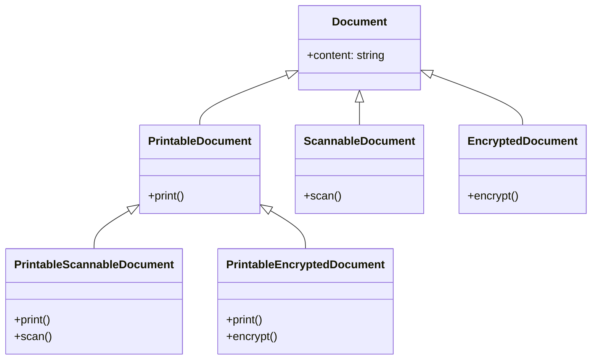

# Composing Objects Principle

Imagine you are tasked with designing a car in a software system. Your first instinct, guided by early lessons in object-oriented programming, might be to think about what a car "is." A car needs an engine to work. An engine has start() and stop() methods. So why not just have the Car class inherit from Engine?

```typescript
// This is the WRONG way to think about it!
class Engine {
    start(): void { /* ... */ }
    stop(): void { /* ... */ }
}

class Car extends Engine { // A Car "is-an" Engine? No!
    // ... other car properties
}
```

This model immediately feels wrong. A car is not an engine. A car has an engine. This simple distinction in language is the key to understanding one of the most powerful principles in object-oriented design: **Favor Composition over Inheritance**.

Inheritance creates an "**is-a**" relationship. Composition creates a "**has-a**" relationship. While inheritance is a powerful tool for creating subtypes, its misuse leads to rigid, fragile, and tangled systems.

Composition, on the other hand, allows you to build complex objects by assembling smaller, independent, and interchangeable parts. Much like building with LEGO blocks, you snap components together, and you can swap any piece without rebuilding the entire structure.

This chapter will explore the classic debate between these two forms of code reuse, revealing why the simple act of "having" is often far more flexible and powerful than the act of "being."

---

## Table of Contents
1. [The Lure of Inheritance (The "Is-A" Relationship)](#1-the-lure-of-inheritance-the-is-a-relationship)
2. [The Fragility of Inheritance](#2-the-fragility-of-inheritance)
   - [Deep Hierarchies & Class Explosion](#deep-hierarchies--class-explosion)
   - [The Fragile Base Class Problem](#the-fragile-base-class-problem)
   - [Tight Coupling (White-Box Reuse)](#tight-coupling-white-box-reuse)
3. [The Power of Composition (The "Has-A" Relationship)](#3-the-power-of-composition-the-has-a-relationship)
   - [Black-Box Reuse](#black-box-reuse)
   - [Dynamic Composition (Runtime Flexibility)](#dynamic-composition-runtime-flexibility)
4. [Comparing Inheritance vs. Composition](#4-comparing-inheritance-vs-composition)
5. [Refactoring Case Study: From Inheritance to Composition](#5-refactoring-case-study-from-inheritance-to-composition)
   - [The Problem: Inheritance Hell (Multi-functional Printer)](#the-problem-inheritance-hell-multi-functional-printer)
   - [The Solution: Composing Behaviors](#the-solution-composing-behaviors)
6. [When is Inheritance Appropriate?](#6-when-is-inheritance-appropriate)
7. [Design Patterns Built on Composition](#7-design-patterns-built-on-composition)
8. [Common Pitfalls and Best Practices](#8-common-pitfalls-and-best-practices)

---

## 1. The Lure of Inheritance (The "Is-A" Relationship)

Inheritance is often the first major concept taught in object-oriented programming. It represents an intuitive way to model the world by categorizing objects into a taxonomy:

*   A `Dog` **is-an** `Animal`.
*   A `SavingsAccount` **is-a** `BankAccount`.
*   A `Button` **is-a** `UIComponent`.

### Why Developers Fall in Love with Inheritance
1.  **Taxonomic Modeling**: It maps directly to how humans classify physical objects (genus and species).
2.  **Immediate Code Reuse**: By extending a parent class, the subclass inherits all fields and methods for free. There is no need to write boilerplate code to delegate calls.
3.  **Polymorphism**: A parent reference can stand in for any child subtype, allowing client code to remain generic (e.g., a list of `Animal` references can all be told to `makeSound()`).

```typescript
class Animal {
    eat(): void {
        console.log("Eating food...");
    }
    
    sleep(): void {
        console.log("Sleeping...");
    }
}

class Dog extends Animal {
    bark(): void {
        console.log("Woof!");
    }
}

const myDog = new Dog();
myDog.eat();   // Inherited method - reuse!
myDog.bark();  // Subclass method
```

This simple hierarchy works beautifully. However, as software grows, real-world requirements rarely fit into neat, hierarchical boxes. 

---

## 2. The Fragility of Inheritance

As systems evolve, inheritance reveals three major design flaws: class explosion, the fragile base class problem, and tight coupling.

### Deep Hierarchies & Class Explosion
When features can be combined in arbitrary ways, mapping them to a tree structure leads to a combinatorial explosion of subclasses.

Imagine you are building a document management system. You start with a base class `Document`. 
- Some documents need to be **Printable**.
- Some need to be **Scannable**.
- Some need to be **Encryptable**.

If we try to model this with inheritance, how do we handle a document that needs to be both printable and encryptable? Or printable, scannable, and encryptable?



As you add new orthogonal concerns (e.g., `Compressible`, `ReadOnly`), you have to create a new class for every single combination. This is called **Class Explosion**. It leads to massive code duplication because `PrintableScannableDocument` and `PrintableEncryptedDocument` must duplicate or separately re-implement their print/scan/encrypt logics if multiple inheritance is not supported (and even when it is, it brings the "Diamond Problem").

### The Fragile Base Class Problem
The **Fragile Base Class Problem** occurs when a minor, logically sound change in a base class silently breaks the behavior of a subclass. This happens because subclasses depend on the exact internal implementation details of the base class.

Let's look at a classic example in TypeScript (inspired by Joshua Bloch's *Effective Java*). We want to create a `CountedSet` that counts the total number of elements added since its creation. We decide to inherit from a standard library-like `HashSet`.

```typescript
class HashSet {
    protected elements: Set<any> = new Set();

    add(element: any): void {
        this.elements.add(element);
    }

    addAll(elements: any[]): void {
        for (const item of elements) {
            this.add(item); // Calls the add() method internally
        }
    }
}

class CountedSet extends HashSet {
    private count: number = 0;

    override add(element: any): void {
        this.count++;
        super.add(element);
    }

    override addAll(elements: any[]): void {
        this.count += elements.length;
        super.addAll(elements);
    }

    getAddedCount(): number {
        return this.count;
    }
}
```

Now, let's run this code:
```typescript
const set = new CountedSet();
set.addAll(["Apple", "Banana", "Cherry"]);
console.log(set.getAddedCount()); // Expected: 3, Actual: 6!
```

#### Why did it output 6 instead of 3?
1. The client called `set.addAll()`.
2. `CountedSet`'s overridden `addAll` added `3` to `count` and called `super.addAll()`.
3. Inside `HashSet`, the base class's `addAll` looped through the items and called `this.add(item)`.
4. Because of dynamic method dispatch (polymorphism), `this.add()` resolved to the *overridden* `add()` in `CountedSet`.
5. The overridden `add()` incremented `count` 3 more times.

This is a **silent failure**. If the author of `HashSet` later changes `addAll` to insert elements directly into the internal set instead of calling `this.add()`, the subclass `CountedSet` would suddenly output `3` (breaking if it relied on the double-increment workaround). You cannot change the base class without risking breaking subclasses whose code you might not even control.

### Tight Coupling (White-Box Reuse)
Inheritance is often called **White-Box Reuse**. The term "white-box" means the internal details of the parent class are visible to the child class. 

Subclasses are tightly coupled to the parent class. If you change a private field name or refactor a protected method signature in the parent class, you risk breaking all subclasses. This breaks encapsulation: the boundary between the parent class and the child class is paper-thin.

---

## 3. The Power of Composition (The "Has-A" Relationship)

Composition is an alternative approach to code reuse. Instead of extending a class to inherit behavior, an object achieves behavior by **composing** other objects that perform the required tasks.

### Black-Box Reuse
Composition is called **Black-Box Reuse** because the composing object only interacts with the composed components through their public interfaces. 

The internals of the composed objects are completely hidden (encapsulated). As long as the interface contract is respected, you can refactor or swap the composed object without any risk of breaking the outer class.

### Dynamic Composition (Runtime Flexibility)
With inheritance, the relationship between a parent and child is **static** (bound at compile time). A `Car` that extends `GasolineEngine` is permanently a gasoline car.

With composition, the relationship is **dynamic** (can be changed at runtime). We can inject the engine and even swap it while the application is running.

```typescript
interface IEngine {
    start(): void;
}

class GasolineEngine implements IEngine {
    start(): void {
        console.log("Vroom! Gasoline engine started.");
    }
}

class ElectricEngine implements IEngine {
    start(): void {
        console.log("Ssssh... Electric motor powered up.");
    }
}

class Car {
    // Car "has-an" engine (Composition)
    private engine: IEngine;

    constructor(engine: IEngine) {
        this.engine = engine;
    }

    // Ability to change behavior dynamically at runtime
    setEngine(newEngine: IEngine): void {
        this.engine = newEngine;
    }

    drive(): void {
        this.engine.start();
        console.log("Car is moving.");
    }
}

// Runtime Usage
const car = new Car(new GasolineEngine());
car.drive(); // Outputs gasoline start

car.setEngine(new ElectricEngine()); // Swapped at runtime!
car.drive(); // Outputs electric start
```

---

## 4. Comparing Inheritance vs. Composition

| Feature | Inheritance ("Is-A") | Composition ("Has-A") |
| :--- | :--- | :--- |
| **Relationship** | Static relationship ("Is-a"). | Dynamic relationship ("Has-a"). |
| **Binding Time** | Compile-time (fixed at design time). | Runtime (can swap components dynamically). |
| **Encapsulation** | Violated (subclass has access to parent internals / protected members). | Maintained (components are black boxes accessed via interfaces). |
| **Coupling** | Tight (changes in parent propagate to all children). | Loose (caller depends on interface; implementation details are hidden). |
| **Testing Ease** | Hard (must mock or instantiate parent setup). | Easy (can easily inject mock interfaces for components). |
| **Class Hierarchy**| Prone to deep trees and class explosion. | Flat, shallow structures consisting of small, single-purpose classes. |

---

## 5. Refactoring Case Study: From Inheritance to Composition

Let's design a system for multi-functional printers.

### The Problem: Inheritance Hell (Multi-functional Printer)
Suppose we have printer systems. We want to support:
1. Standard Printers (Print only)
2. Scanners (Scan only)
3. Multifunction Printers (Print + Scan + Copier)
4. Secure Printers (Print + Encrypt)

If we use inheritance, we quickly run into multiple-inheritance limitations or duplicate code across classes.

```typescript
class Document {
    constructor(public content: string) {}
}

// Base class
class PrinterDevice {
    print(doc: Document): void {
        console.log(`Printing: ${doc.content}`);
    }
}

// Scanner branch
class ScannerDevice extends PrinterDevice {
    scan(): Document {
        console.log("Scanning document...");
        return new Document("Scanned Content");
    }
}

// What if a device can ONLY scan, but not print?
// Inheriting from PrinterDevice forces ScannerDevice to have print()!
// What about a SecurePrinter that prints and encrypts?
class SecurePrinter extends PrinterDevice {
    encrypt(doc: Document): Document {
        console.log("Encrypting document...");
        return new Document(`[Encrypted] ${doc.content}`);
    }

    override print(doc: Document): void {
        const encrypted = this.encrypt(doc);
        super.print(encrypted);
    }
}

// What about a SecureMultifunctionPrinter (Print + Scan + Encrypt)?
// We would have to copy scan() from ScannerDevice or copy encrypt() from SecurePrinter!
```

---

### The Solution: Composing Behaviors
Instead of forcing printers to *be* engines or scanners, we break down capabilities into small, interface-driven components and inject them into a configurable device.

```typescript
// 1. Define behavioral interfaces
interface IPrinter {
    print(content: string): void;
}

interface IScanner {
    scan(): string;
}

interface IEncryptor {
    encrypt(content: string): string;
}

// 2. Implement concrete behaviors
class StandardPrinter implements IPrinter {
    print(content: string): void {
        console.log(`[INKJET] Print: ${content}`);
    }
}

class StandardScanner implements IScanner {
    scan(): string {
        return "Standard scanned data";
    }
}

class AesEncryptor implements IEncryptor {
    encrypt(content: string): string {
        return `[AES-Encrypted] { ${content} }`;
    }
}

// 3. Create a Composed Device class
class MultifunctionDevice {
    private printer?: IPrinter;
    private scanner?: IScanner;
    private encryptor?: IEncryptor;

    constructor(components: { printer?: IPrinter; scanner?: IScanner; encryptor?: IEncryptor }) {
        this.printer = components.printer;
        this.scanner = components.scanner;
        this.encryptor = components.encryptor;
    }

    printDocument(content: string): void {
        if (!this.printer) {
            throw new Error("Print feature not supported on this device.");
        }
        
        let output = content;
        if (this.encryptor) {
            output = this.encryptor.encrypt(content);
        }
        
        this.printer.print(output);
    }

    scanDocument(): string {
        if (!this.scanner) {
            throw new Error("Scan feature not supported on this device.");
        }
        return this.scanner.scan();
    }
}

// --- Usage ---
// 1. Build a basic print-only device
const basicPrinter = new MultifunctionDevice({ 
    printer: new StandardPrinter() 
});
basicPrinter.printDocument("Hello World"); // Outputs Inkjet Print: Hello World

// 2. Build a high-security scanner and printer dynamically
const secureMfd = new MultifunctionDevice({
    printer: new StandardPrinter(),
    scanner: new StandardScanner(),
    encryptor: new AesEncryptor()
});
secureMfd.printDocument("Confidential Report"); // Outputs Inkjet Print: [AES-Encrypted] { Confidential Report }
```

> [!TIP]
> ### Why this composition design is superior:
> 1.  **Zero Duplication**: The scanning logic (`StandardScanner`) and encryption logic (`AesEncryptor`) are written exactly once and can be mixed and matched freely.
> 2.  **Granular Feature Toggle**: A device can support printing, scanning, or encryption independently by passing or omitting arguments in the constructor. We do not need a matrix of subclasses.
> 3.  **Strict Interface Compliance**: We can easily write a `3DPrinter` class implementing `IPrinter` and inject it in place of `StandardPrinter` without touching any of the `MultifunctionDevice` logic.

---

## 6. When is Inheritance Appropriate?

Composition is the preferred default, but inheritance is not an anti-pattern when used correctly. Inheritance is appropriate in the following scenarios:

1.  **Strict Taxonomic "Is-A" Relationship (Liskov Substitution Principle)**:
    If a subclass can completely stand in for its parent class in all contexts without breaking the system, inheritance is valid. For example, `Circle` extending `Shape`, or `FileStream` extending `Stream`.
2.  **Shallow Hierarchies**:
    Limit inheritance hierarchies to **one level deep**. Deep hierarchies (3+ levels) are almost always a design mistake.
3.  **Interface Inheritance (Realization)**:
    Implementing an interface (e.g., `class Dog implements IAnimal`) is technically a form of inheritance (subtyping). This is highly encouraged as it creates no coupling to concrete base code.
4.  **Framework Customization**:
    Many frameworks use template methods in base classes that you must extend to integrate (e.g., React's `React.Component`, Android's `Activity`, or NestJS's `Controller`). Since you don't control the framework lifecycle, extending the provided base class is the standard extension point.

---

## 7. Design Patterns Built on Composition

Many of the classic Gang of Four (GoF) design patterns exist specifically to replace inheritance structures with composition:

*   **Strategy Pattern**: Swaps algorithms at runtime by composing a strategy interface rather than subclassing the client to implement different versions of the algorithm.
*   **Decorator Pattern**: Dynamically adds behaviors to an object at runtime by wrapping it in decorator classes that implement the same interface.
*   **Adapter Pattern**: Connects incompatible interfaces by composing an instance of the class that needs adapting inside the adapter class.
*   **Composite Pattern**: Treats individual objects and compositions of objects uniformly using a tree structure composed of shared interfaces.

---

## 8. Common Pitfalls and Best Practices

### The Delegation Boilerplate Pitfall
*   **The Problem**: Because composition doesn't automatically inherit methods, you have to write "pass-through" methods (delegation) in the parent class to call methods on the composed components.
    ```typescript
    class Car {
        private engine = new Engine();
        start(): void {
            this.engine.start(); // Boilerplate delegation
        }
    }
    ```
    If a composed class has 30 methods and you want to expose them all, writing 30 delegate methods is tedious.
*   **The Solution**: If you need to expose all of a component's methods, ask yourself if the component's interface should simply be exposed directly to the caller, or if the client should interact with the component directly. Alternatively, use patterns like the **Facade Pattern** to expose a simplified subset of operations.

### Over-composing (Component Bloat)
*   **The Pitfall**: Breaking everything down into tiny, microscopic objects. A class representing a `User` doesn't need separate composed objects for `UserFirstName`, `UserLastName`, `UserBirthDate`, etc., unless those fields have complex, distinct business behaviors.
*   **The Solution**: Group properties that change together. Maintain a pragmatic balance between class count and responsibility cohesion.

### Summary Rule of Thumb
> **Inherit for subtyping (polymorphism). Compose for behavior and code reuse.**
