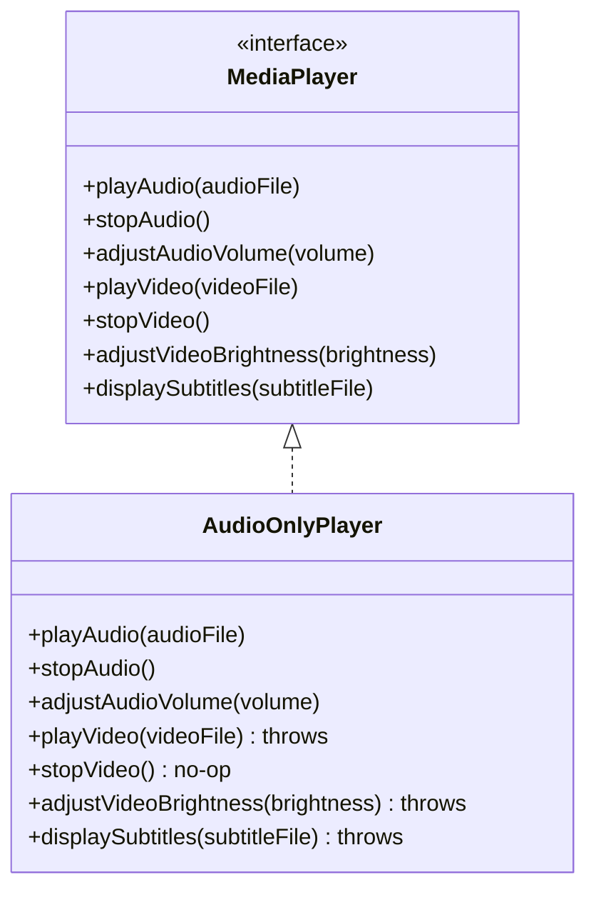
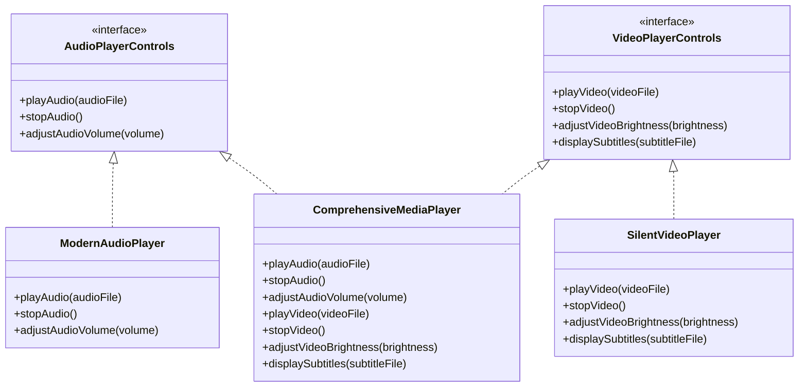

# Interface Segregation Principle (ISP)

Have you ever implemented an interface… only to realize you had to write empty methods just to make the compiler happy?

Or updated a shared interface… and suddenly watched multiple unrelated classes start breaking?

If so, you have probably run into a violation of one of the most misunderstood design principles in software engineering: the **Interface Segregation Principle (ISP)**.

This chapter explains what ISP really means, why fat interfaces cause problems, how to break them apart, and how to avoid common mistakes when applying the principle. Let's start with a real-world example.

---

## 1. The Problem: A Fat Interface

Imagine you are building a media player app that supports different types of media:
* **Audio files** (MP3, WAV)
* **Video files** (MP4, AVI)

You might start with what feels like a convenient design: a single, unified interface that handles everything.

```typescript
interface MediaPlayer {
    playAudio(audioFile: string): void;
    stopAudio(): void;
    adjustAudioVolume(volume: number): void;

    playVideo(videoFile: string): void;
    stopVideo(): void;                
    adjustVideoBrightness(brightness: number): void;
    displaySubtitles(subtitleFile: string): void;
}
```

At first, this seems efficient. One interface, all capabilities. But as your app grows, problems start to show.

Let's say you want to create a pure audio player, a class that should only handle sound:

```typescript
class AudioOnlyPlayer implements MediaPlayer {
    playAudio(audioFile: string): void {
        console.log(`Playing audio file: ${audioFile}`);
    }

    stopAudio(): void {
        console.log("Audio stopped.");
    }

    adjustAudioVolume(volume: number): void {
        console.log(`Audio volume set to: ${volume}`);
    }

    // Methods this class should not care about:
    playVideo(videoFile: string): void {
        throw new Error("Not supported.");
    }

    stopVideo(): void { /* no-op */ }

    adjustVideoBrightness(brightness: number): void {
        throw new Error("Not supported.");
    }

    displaySubtitles(subtitleFile: string): void {
        throw new Error("Not supported.");
    }
}
```

Even though `AudioOnlyPlayer` only needs audio methods, it is forced to implement unrelated video functionality. You either throw exceptions or write empty methods. Neither is a good outcome.

### What’s Wrong With This?

#### Interface Pollution
The `MediaPlayer` interface is doing too much. It combines multiple unrelated responsibilities: audio playback, video playback, subtitle handling, and brightness control.

Any class that implements this interface must carry the weight of all seven methods, even when it only needs three. This is what's known as a **"fat"** or **"polluted"** interface.

#### Fragile Code
Now, imagine you add a new method to the interface, like `enablePictureInPicture()`. Suddenly, all existing implementations—audio-only, video-only, or otherwise—must be updated.

This tight coupling slows you down and increases the risk of bugs. One method addition forces changes across files that have nothing to do with picture-in-picture mode.

#### Violates Liskov Substitution
A client may expect any `MediaPlayer` to support video, but passing in an `AudioOnlyPlayer` will crash the program with an `UnsupportedOperationException`.

That is a clear **Liskov Substitution Principle (LSP)** violation. If a subtype cannot stand in for its base type without breaking callers, the contract is unreliable.



*Half of `AudioOnlyPlayer`'s methods are either no-ops or throw exceptions. That is a clear sign the interface is too broad.*

---

## 2. Enter: The Interface Segregation Principle (ISP)

> **Clients should not be forced to depend on methods they do not use.**

In simpler terms: **Keep your interfaces focused.** Each interface should represent a specific capability or behavior. If a class doesn’t need a method, it shouldn’t be forced to implement it.

This is especially important in larger codebases with evolving requirements. The more methods an interface has, the more likely it is that a change to one method will ripple out into classes that have nothing to do with the change.

ISP was coined by Robert C. Martin (Uncle Bob) and is the fourth principle in the SOLID acronym. It applies to any language that supports interfaces or abstract base classes, but it is particularly relevant in statically typed languages where the compiler enforces that every method in an interface is implemented.

### Why Does ISP Matter?

* **Increased Cohesion, Reduced Coupling:** Interfaces become highly focused. `AudioOnlyPlayer` only knows about audio methods. `VideoPlayer` (if it only played video without sound) would only know about video methods. This minimizes unnecessary dependencies.
* **Improved Flexibility & Reusability:** Smaller, role-specific interfaces are easier for classes to implement correctly. You can combine capabilities as needed (like a full video player implementing both audio and video interfaces).
* **Better Code Readability & Maintainability:** It's much clearer what a class can and cannot do. When the `MediaPlayer` interface was fat, a developer looking at an `AudioOnlyPlayer` might be misled. With ISP, the implemented interfaces clearly state its capabilities.
* **Enhanced Testability:** When testing a client that uses, say, an `IAudioPlayer` interface, you only need to mock the audio-specific methods, not a whole slew of unrelated video methods.
* **Avoids "Interface Pollution" and LSP Violations:** Classes aren't forced to implement methods they don't need, drastically reducing the likelihood of `UnsupportedOperationExceptions` and making subtypes more reliably substitutable for the interfaces they claim to implement.

---

## 3. Applying ISP

Time to apply ISP and break down our `MediaPlayer` interface into more logical, focused pieces.

### Step 1: Define Smaller, Cohesive Interfaces
Instead of one bloated `MediaPlayer` interface, we’ll create multiple focused ones:

```typescript
// Audio-only capabilities
interface AudioPlayerControls {
    playAudio(audioFile: string): void;
    stopAudio(): void;
    adjustAudioVolume(volume: number): void;
}

// Video-only capabilities
interface VideoPlayerControls {
    playVideo(videoFile: string): void;
    stopVideo(): void;
    adjustVideoBrightness(brightness: number): void;
    displaySubtitles(subtitleFile: string): void;
}
```

### Step 2: Classes Implement Only the Interfaces They Need
Now our specific player classes can implement only the relevant interfaces. No more empty methods, no more exceptions for unsupported operations.

#### ModernAudioPlayer (Audio-only)

```typescript
class ModernAudioPlayer implements AudioPlayerControls {
    playAudio(audioFile: string): void {
        console.log(`ModernAudioPlayer: Playing audio - ${audioFile}`);
    }

    stopAudio(): void {
        console.log("ModernAudioPlayer: Audio stopped.");
    }

    adjustAudioVolume(volume: number): void {
        console.log(`ModernAudioPlayer: Volume set to ${volume}`);
    }
}
```

#### SilentVideoPlayer (Video-only)

```typescript
class SilentVideoPlayer implements VideoPlayerControls {
    playVideo(videoFile: string): void {
        console.log(`SilentVideoPlayer: Playing video - ${videoFile}`);
    }

    stopVideo(): void {
        console.log("SilentVideoPlayer: Video stopped.");
    }

    adjustVideoBrightness(brightness: number): void {
        console.log(`SilentVideoPlayer: Brightness set to ${brightness}`);
    }

    displaySubtitles(subtitleFile: string): void {
        console.log(`SilentVideoPlayer: Subtitles from ${subtitleFile}`);
    }
}
```

What if you need a player that handles both audio and video? It simply implements both interfaces.

#### ComprehensiveMediaPlayer (Both audio + video)

```typescript
class ComprehensiveMediaPlayer implements AudioPlayerControls, VideoPlayerControls {
    playAudio(audioFile: string): void {
        console.log(`ComprehensiveMediaPlayer: Playing audio - ${audioFile}`);
    }

    stopAudio(): void {
        console.log("ComprehensiveMediaPlayer: Audio stopped.");
    }

    adjustAudioVolume(volume: number): void {
        console.log(`ComprehensiveMediaPlayer: Audio volume set to ${volume}`);
    }

    playVideo(videoFile: string): void {
        console.log(`ComprehensiveMediaPlayer: Playing video - ${videoFile}`);
    }

    stopVideo(): void {
        console.log("ComprehensiveMediaPlayer: Video stopped.");
    }

    adjustVideoBrightness(brightness: number): void {
        console.log(`ComprehensiveMediaPlayer: Brightness set to ${brightness}`);
    }

    displaySubtitles(subtitleFile: string): void {
        console.log(`ComprehensiveMediaPlayer: Subtitles from ${subtitleFile}`);
    }
}
```

Now each class implements only the interfaces it needs. `ModernAudioPlayer` handles audio, `SilentVideoPlayer` handles video, and `ComprehensiveMediaPlayer` opts into both. No empty methods, no exceptions, no wasted code.



*This is the essence of the Interface Segregation Principle in action. The interfaces are small, focused, and composable. A class picks up only the contracts it can fully honor.*

---

## 4. Common Pitfalls While Applying ISP

Even with the right intentions, it is easy to misuse ISP if you are not careful. Here are three common traps to avoid.

### 1. Over-Segregation (a.k.a. “Interface-itis”)
* **The mistake:** Creating a separate interface for every single method, like `Playable`, `Stoppable`, `AdjustableVolume`, and so on.
* **Why it's a problem:** You end up with too many tiny interfaces that are hard to manage and understand. It is just as bad as having one big, bloated interface, only now the complexity is spread across dozens of files instead of concentrated in one.
* **The fix:** Group related methods by logical roles or capabilities. For example, `playAudio()`, `stopAudio()`, and `adjustAudioVolume()` naturally belong together in an `AudioPlayerControls` interface. They represent one cohesive role: controlling audio playback.

### 2. Not Thinking from the Client’s Perspective
* **The mistake:** Designing interfaces based only on how implementers work, not how clients use them.
* **Why it's a problem:** ISP is really about making life easier for the client, not the implementer. If a client only needs to control audio playback, it should depend on an `AudioPlayerControls` interface, not a giant `MediaPlayer` that exposes video methods the client will never call.
* **The fix:** Design your interfaces by looking at what the client actually needs to do, and nothing more. Start with the client code and ask: *"What is the minimal set of methods this caller requires?"*

### 3. Lack of Cohesion
* **The mistake:** Creating interfaces that are not tightly related, mixing unrelated methods together.
* **Why it's a problem:** Low cohesion makes interfaces confusing and hard to reason about. If an interface has methods that don't logically belong together, you have the same problem as a fat interface, just with a different name.
* **The fix:** Make sure every method in an interface relates to a single, well-defined responsibility. Think of your interface as a role. Would it make sense for all these actions to be part of that role?

---

## 5. Common Questions About ISP

### How do I know how small my interfaces should be?
There’s no strict number of methods or “one-size-fits-all” guideline. The best rule of thumb is: **design interfaces based on client needs.**

Ask yourself:
1. Are all methods in the interface used by every implementing class?
2. Are different clients interested in different capabilities?

If the answer is yes to either, it’s a strong signal that the interface should be split.

Think in terms of **roles or capabilities**—interfaces should represent a cohesive set of behaviors that make sense together from the client’s perspective.

---

### Won’t creating lots of small interfaces just add more files and complexity?
At first glance, yes. It might feel like you’re adding more moving parts. But this is **intentional structure**, not clutter. Over time, it pays off by:
* Making your code easier to understand
* Reducing coupling between unrelated components
* Preventing unnecessary dependencies

Instead of trying to comprehend one giant interface with 15 methods, you now deal with clear, focused contracts. It’s a shift from accidental complexity to intentional design.

---

### Should I apply ISP only to new code, or is it worth refactoring old code too?
You should definitely apply ISP when writing new code. For existing code, refactoring is worth it when you notice any of the following:
* Frequent use of `UnsupportedOperationException`
* Classes implementing methods they don’t use
* Interface changes breaking many unrelated classes
* Confusion about which methods clients can safely call

**Where to start:** Focus on the interfaces causing the most pain—those that are bloated, unstable, or widely misused.

---

### Can a class implement multiple small interfaces?
Absolutely—and that’s one of the key benefits of ISP.

A class can fulfill multiple roles by implementing several small, targeted interfaces. This gives you incredible flexibility and composability.

For example, an `AudioPlayer` might implement:
* `LoadableMedia`
* `PlaybackControls`
* `VolumeControl`
* `AudioFeatures`

Each interface is simple and focused, and the class only opts into the behaviors it supports.

---

### How does ISP relate to the Liskov Substitution Principle (LSP)?
ISP and LSP are closely aligned:
* **ISP** ensures that interfaces are minimal and relevant.
* **LSP** ensures that implementations of those interfaces behave correctly and predictably.

When interfaces are too broad (violating ISP), classes are often forced to implement methods they don’t support. This commonly leads to LSP violations like throwing `UnsupportedOperationException` where the client expects normal behavior.

By applying ISP, you make LSP easier to follow because each interface becomes a clean, reliable contract that implementers can fulfill completely and correctly.
