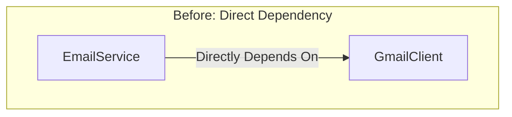
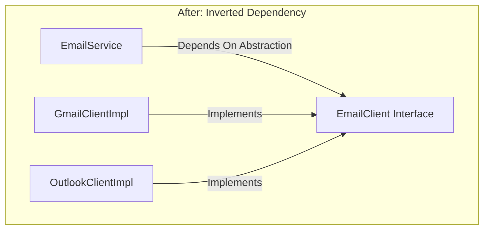

# Dependency Inversion Principle (DIP)

Have you ever tried to swap out a database, switch an email provider, or replace a third-party API, only to realize that your business logic was so tangled with the implementation details that changing one thing meant rewriting half the class?

If so, you have run into a violation of one of the most practical design principles in software engineering: the Dependency Inversion Principle (DIP).

This chapter explains what DIP really means, why high-level modules should never depend directly on low-level modules, how to use abstractions to decouple them, and the common mistakes developers make when applying this principle.

Let's start with a real-world example.

---

## 1. The Problem: A Tightly Coupled `EmailService`
Imagine you are building an `EmailService`. Your first task is to send emails using Gmail. So you write something like this.

Here is the low-level module, a `GmailClient` that knows how to talk to Gmail's servers.

```typescript
class GmailClient {
    sendGmail(toAddress: string, subjectLine: string, emailBody: string): void {
        console.log("Connecting to Gmail SMTP server...");
        console.log(`Sending email via Gmail to: ${toAddress}`);
        console.log(`Subject: ${subjectLine}`);
        console.log(`Body: ${emailBody}`);
        // ... actual Gmail API interaction logic ...
        console.log("Gmail email sent successfully!");
    }
}
```

And here is the high-level module, the `EmailService` that handles business logic like sending welcome emails and password resets.

```typescript
class EmailService {
    private gmailClient: GmailClient;

    constructor() {
        this.gmailClient = new GmailClient();
    }

    sendWelcomeEmail(userEmail: string, userName: string): void {
        const subject = `Welcome, ${userName}!`;
        const body = "Thanks for signing up to our awesome platform. We're glad to have you!";
        this.gmailClient.sendGmail(userEmail, subject, body);
    }

    sendPasswordResetEmail(userEmail: string): void {
        const subject = "Reset Your Password";
        const body = "Please click the link below to reset your password...";
        this.gmailClient.sendGmail(userEmail, subject, body);
    }
}
```

At first glance, this seems totally fine. It works, it is readable, and it sends emails.

### Why Switching Providers Is Painful
Then one day, a product manager asks:

> "Can we switch from Gmail to Outlook for sending emails?"

Suddenly, you have a problem. Your `EmailService`, a high-level component that handles business logic, is tightly coupled to `GmailClient`, a low-level implementation detail. To switch providers, you would have to:

* Rewrite parts of `EmailService`
* Replace every `gmailClient` method call with `outlookClient` ones
* Change the constructor

And that is just for one provider swap. Now imagine needing to support multiple email providers (Gmail, Outlook, SES) or dynamically select a provider based on configuration. Your `EmailService` would quickly turn if-else soup.

This is exactly the kind of pain the Dependency Inversion Principle (DIP) helps you avoid.

---

## 2. The Dependency Inversion Principle
The legendary Robert C. Martin (Uncle Bob) lays down DIP with two golden rules:

> 1. High-level modules should not depend on low-level modules. Both should depend on abstractions (e.g., interfaces).
> 2. Abstractions should not depend on details. Details (concrete implementations) should depend on abstractions.

In plain English:

* Business logic should not rely directly on implementation details.
* Instead, both should depend on a common interface or abstraction.

You might wonder what exactly is being "inverted." It is the direction of dependency. Without DIP, high-level modules depend directly on low-level modules. With DIP, both the high-level module and the low-level module depend on a shared abstraction (an interface or abstract class).

The control flow might still go from high to low, but the source code dependency is inverted. High-level modules define what they need (the contract/interface), and low-level modules provide the how (the implementation of that interface).

### Dependency Direction Visualized





On the left, `EmailService` depends directly on `GmailClient`. Any change to Gmail's API forces changes in `EmailService`. On the right, both `EmailService` and the concrete clients depend on the `EmailClient` interface. 

`EmailService` is now shielded from implementation details, and you can swap providers without touching business logic.

### Why Does DIP Matter?
* **Decoupling.** High-level modules become independent of the nitty-gritty details of low-level modules. Your business logic does not care whether emails go through Gmail, Outlook, or carrier pigeon.
* **Flexibility and Extensibility.** Need to switch from Gmail to Outlook? Or add an SMS provider? Just create a new class that implements the shared abstraction and plug it in. The high-level module does not need to change at all.
* **Enhanced Testability.** You can easily swap out real dependencies with mock objects or test doubles. Testing `EmailService` in isolation without hitting an actual email server becomes trivial.
* **Improved Maintainability.** Changes in one part of the system are less likely to break others. If `GmailClient`'s internal API changes, it only affects `GmailClient`, not `EmailService`, as long as the abstraction remains the same.
* **Parallel Development.** Once the abstraction (interface) is defined, different teams can work independently. One team can build the `EmailService` (high-level) while other teams build different `EmailClient` implementations (low-level).

---

## 3. Applying DIP
Let's refactor our original example step-by-step using DIP.

### Step 1: Define the Abstraction (The Contract)
We need an interface that defines what any email sending mechanism should be able to do. This interface becomes the contract that both high-level and low-level modules depend on.

```typescript
interface EmailClient {
    sendEmail(to: string, subject: string, body: string): void;
}
```

### Step 2: Concrete Implementations
Now, our specific email clients (the "details") implement the above interface. Each one knows how to talk to its own email provider, but they all share the same contract.

Here is the Gmail implementation:

```typescript
class GmailClientImpl implements EmailClient {
    sendEmail(to: string, subject: string, body: string): void {
        console.log("Connecting to Gmail SMTP server...");
        console.log(`Sending email via Gmail to: ${to}`);
        console.log(`Subject: ${subject}`);
        console.log(`Body: ${body}`);
        // ... actual Gmail API interaction logic ...
        console.log("Gmail email sent successfully!");
    }
}
```

And here is the Outlook implementation:

```typescript
class OutlookClientImpl implements EmailClient {
    sendEmail(to: string, subject: string, body: string): void {
        console.log("Connecting to Outlook Exchange server...");
        console.log(`Sending email via Outlook to: ${to}`);
        console.log(`Subject: ${subject}`);
        console.log(`Body: ${body}`);
        // ... actual Outlook API interaction logic ...
        console.log("Outlook email sent successfully!");
    }
}
```

### Step 3: Update the High-Level Module
Now comes the key change. Our `EmailService` will no longer know about `GmailClientImpl` or `OutlookClientImpl`. It will only know about the `EmailClient` interface. The actual implementation gets "injected" into it from the outside.

This technique is called **Dependency Injection (DI)**, and it is one of the most common ways to achieve DIP in practice.

```typescript
class EmailService {
    private readonly emailClient: EmailClient; // Depends on the INTERFACE!

    // Dependency is "injected" via the constructor
    constructor(emailClient: EmailClient) {
        this.emailClient = emailClient;
    }

    sendWelcomeEmail(userEmail: string, userName: string): void {
        const subject = `Welcome, ${userName}!`;
        const body = "Thanks for signing up to our awesome platform. We're glad to have you!";
        this.emailClient.sendEmail(userEmail, subject, body); // Calls the interface method
    }

    sendPasswordResetEmail(userEmail: string): void {
        const subject = "Your Password Reset Request";
        const body = "Please click the link below to reset your password...";
        this.emailClient.sendEmail(userEmail, subject, body);
    }
}
```

Our `EmailService` is now completely decoupled from the concrete email sending mechanisms. It is flexible, extensible, and easy to test.

### Step 4: Using it in Your Application
Somewhere in your application (often near the main method, or managed by a DI framework like Spring or Guice), you decide which concrete implementation to use and pass it to `EmailService`. This is where the "wiring" happens, and it is the only place in your code that knows about concrete classes.

```typescript
class Main {
    static main(): void {
        console.log("--- Using Gmail ---");
        const gmailService = new EmailService(new GmailClientImpl());
        gmailService.sendWelcomeEmail("test@example.com", "Welcome to SOLID principles!");

        console.log("--- Using Outlook ---");
        const outlookService = new EmailService(new OutlookClientImpl());
        outlookService.sendWelcomeEmail("test@example.com", "Welcome to SOLID principles!");
    }
}

Main.main();
```

Notice the beauty of this design. Switching from Gmail to Outlook requires zero changes to `EmailService`. You just pass a different implementation at the composition root.

If tomorrow you need to add Amazon SES support, you create a new `SesClientImpl` that implements `EmailClient`, and every part of your application that depends on `EmailClient` can use it immediately.

---

## 4. Common Pitfalls While Applying DIP
While DIP is powerful, watch out for these common missteps that can undermine your design or create unnecessary complexity.

### 1. Over-Abstraction
The mistake is creating interfaces for everything, even for stable utility classes that are unlikely to change. Too many unnecessary abstractions lead to clutter, boilerplate, and confusion. Someone looking at your codebase has to navigate through layers of indirection just to understand what a simple method does.

Use interfaces when they add real value:
* For external dependencies (APIs, email providers, databases)
* For components that might change or have multiple implementations
* For parts you need to mock in tests

If something is stable and internal, do not abstract it just for the sake of DIP.

### 2. Leaky Abstractions
The mistake is exposing implementation-specific logic in your interface. For example, adding a method like `configureGmailSpecificSetting()` to the `EmailClient` interface defeats the entire purpose of the abstraction.

Now your interface knows about Gmail, which means you are still tightly coupled. Interfaces should only expose what the high-level module needs, not what a specific implementation does behind the scenes.

### 3. Interfaces Owned by Low-Level Modules
The mistake is letting the low-level module define the interface it implements. For example, if `GmailClient` defines `IGmailClient`, and then `EmailService` depends on `IGmailClient`, the high-level module is still tied to the low-level module's namespace and structure.

The abstraction should be defined by the high-level module (or in a neutral shared module), not by the implementation.

### 4. No Actual Injection
The mistake is depending on an interface but still creating the concrete implementation inside the class:
```typescript
this.emailClient = new GmailClient(); // ❌
```

You are still tightly coupled. This defeats the purpose of inversion. The dependency needs to come from the outside, either via constructor injection, setter injection, or a framework like Spring.

---

## 5. Common Questions About DIP

### Is DIP the same as Dependency Injection (DI)?
> **Answer:**
> Not exactly.
>
> * **Dependency Inversion (DIP)** is a principle: “Depend on abstractions, not concrete implementations.”
> * **Dependency Injection (DI)** is a technique used to achieve DIP: You inject dependencies into a class (via constructor, setter, or method) instead of the class creating them itself.
>
> You can follow DIP without using a DI container, and you can use DI without necessarily following DIP (though you probably should do both!).

---

### Is DIP the same as Inversion of Control (IoC)?
> **Answer:**
> Nope, but they’re related.
>
> * **Inversion of Control (IoC)** is a broader design concept where the flow of control is inverted. Instead of your code calling libraries, a framework or container calls your code (e.g., Spring controlling object creation and lifecycle).
> * **DIP** is one specific way to achieve IoC — by inverting who depends on whom (high-level modules depend on abstractions, not implementations).
>
> Think of IoC as the big idea, and DIP as one way to implement that idea for dependencies.

---

### Do I need an interface for every class?
> **Answer:**
> Definitely not.
>
> Use DIP where it makes sense, like:
> * When working with external systems (APIs, databases, email providers)
> * When building layers of your application (e.g., services calling repositories)
> * When you need flexibility or want to mock something during testing
>
> If there’s only ever going to be one implementation and no real benefit from decoupling, skip the abstraction.

---

### Doesn’t this create a lot of extra classes and interfaces?
> **Answer:**
> It can, but that’s not a bad thing.
>
> Yes, you might end up with more files. But:
> * Your code becomes easier to test
> * It's more adaptable to change
> * It's easier for teams to work on different layers independently
>
> In short: a few extra classes = a much more maintainable and scalable system.

---

### Where should these abstractions or interfaces live in my project?
> **Answer:**
> In most cases, the client (the high-level module) should define the interface because it's the one saying:
>
> For example:
> * `EmailClient` interface can live in the same package/module as `EmailService`.
> * If you're in a large codebase, you might keep all interfaces in a shared `contracts` or `api` module.
>
> **The key idea:** Don’t make the high-level module depend on anything buried deep in the low-level implementation's territory — otherwise, you’re right back to tight coupling.
